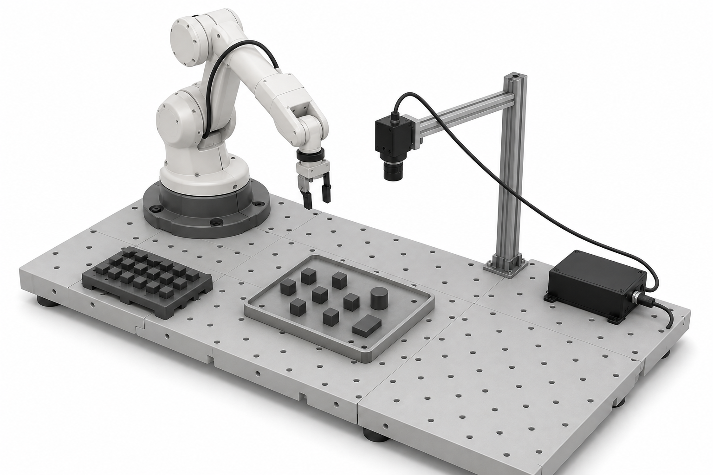

# Why frames and poses matter

Many robot tasks are about motion and positioning. A tool has to approach a
part, a gripper has to align with a handle, a camera has to measure a workpiece,
or a pallet has to be placed relative to a fixture. To program and debug these
tasks, we need tools for describing positions and orientations in space.

On this page we use one running example: a camera-guided pick operation. A
camera observes a workpiece, and the robot has to move its gripper to the right
pick pose. To make that work, the cell needs to know where the camera is, where
the workpiece is seen by the camera, and where the gripper should be relative to
the workpiece. In the equations below, `part` is used as a short name for the
workpiece frame.

The two basic ideas are:

- A **coordinate frame** is a local reference system with an origin and axis
  directions.
- A **pose** describes the position and orientation of one frame relative to
  another frame.

For robot tools, the important tool point is usually called the **TCP**: the
tool center point.

The figure below shows the running example. The robot, camera, workpiece, and
gripper TCP each get their own coordinate frame. The axes of a frame tell us how
to measure position and orientation locally at that object.

```{=html}
<figure class="cell-example-figure">
  <div class="cell-example-figure__canvas">
    
    <svg viewBox="0 0 1536 1024" aria-hidden="true">
      <defs>
        <marker id="cell-frame-arrow-x" markerWidth="7" markerHeight="7" refX="5.5" refY="2.5" orient="auto" markerUnits="strokeWidth">
          <path d="M 0 0 L 5.5 2.5 L 0 5 z"></path>
        </marker>
        <marker id="cell-frame-arrow-y" markerWidth="7" markerHeight="7" refX="5.5" refY="2.5" orient="auto" markerUnits="strokeWidth">
          <path d="M 0 0 L 5.5 2.5 L 0 5 z"></path>
        </marker>
        <marker id="cell-frame-arrow-z" markerWidth="7" markerHeight="7" refX="5.5" refY="2.5" orient="auto" markerUnits="strokeWidth">
          <path d="M 0 0 L 5.5 2.5 L 0 5 z"></path>
        </marker>
      </defs>
      <g class="cell-frame cell-frame--base" transform="translate(430 420)">
        <line class="cell-frame__axis cell-frame__axis--x" x1="0" y1="0" x2="78" y2="26" marker-end="url(#cell-frame-arrow-x)"></line>
        <line class="cell-frame__axis cell-frame__axis--y" x1="0" y1="0" x2="-62" y2="35" marker-end="url(#cell-frame-arrow-y)"></line>
        <line class="cell-frame__axis cell-frame__axis--z" x1="0" y1="0" x2="0" y2="-86" marker-end="url(#cell-frame-arrow-z)"></line>
        <circle class="cell-frame__origin" cx="0" cy="0" r="7"></circle>
        <text class="cell-frame__label" x="-58" y="-98">base frame</text>
      </g>
      <g class="cell-frame cell-frame--tcp" transform="translate(682 392)">
        <line class="cell-frame__axis cell-frame__axis--x" x1="0" y1="0" x2="52" y2="18" marker-end="url(#cell-frame-arrow-x)"></line>
        <line class="cell-frame__axis cell-frame__axis--y" x1="0" y1="0" x2="-44" y2="24" marker-end="url(#cell-frame-arrow-y)"></line>
        <line class="cell-frame__axis cell-frame__axis--z" x1="0" y1="0" x2="0" y2="58" marker-end="url(#cell-frame-arrow-z)"></line>
        <circle class="cell-frame__origin" cx="0" cy="0" r="6"></circle>
        <text class="cell-frame__label" x="20" y="82">TCP frame</text>
      </g>
      <g class="cell-frame cell-frame--camera" transform="translate(832 352)">
        <line class="cell-frame__axis cell-frame__axis--x" x1="0" y1="0" x2="56" y2="18" marker-end="url(#cell-frame-arrow-x)"></line>
        <line class="cell-frame__axis cell-frame__axis--y" x1="0" y1="0" x2="-48" y2="28" marker-end="url(#cell-frame-arrow-y)"></line>
        <line class="cell-frame__axis cell-frame__axis--z" x1="0" y1="0" x2="0" y2="62" marker-end="url(#cell-frame-arrow-z)"></line>
        <circle class="cell-frame__origin" cx="0" cy="0" r="6"></circle>
        <text class="cell-frame__label" x="22" y="-18">camera frame</text>
      </g>
      <g class="cell-frame cell-frame--part" transform="translate(700 628)">
        <line class="cell-frame__axis cell-frame__axis--x" x1="0" y1="0" x2="64" y2="22" marker-end="url(#cell-frame-arrow-x)"></line>
        <line class="cell-frame__axis cell-frame__axis--y" x1="0" y1="0" x2="-56" y2="30" marker-end="url(#cell-frame-arrow-y)"></line>
        <line class="cell-frame__axis cell-frame__axis--z" x1="0" y1="0" x2="0" y2="-66" marker-end="url(#cell-frame-arrow-z)"></line>
        <circle class="cell-frame__origin" cx="0" cy="0" r="6"></circle>
        <text class="cell-frame__label" x="20" y="-72">part frame</text>
      </g>
    </svg>
  </div>
  <figcaption>Running example for this page: a camera observes a tray of small objects, and the robot moves the gripper TCP to pick one selected cube. The overlaid coordinate frames show the reference systems used in the transform chain.</figcaption>
</figure>
```

A **point** is only a position. It can describe where a hole, corner, or detected
feature is. A **pose** is stronger: it describes both position and orientation.
A welding torch, gripper, camera, screwdriver, or dispensing nozzle must be at
the right place and point in the right direction. Position is the "where".
Orientation is the "which way".

Different robot systems expose this in different formats. A KUKA target is often
written with `X`, `Y`, `Z`, `A`, `B`, and `C`. Universal Robots uses poses such
as `p[x, y, z, rx, ry, rz]`. The numbers and angle conventions differ, but the
idea is the same: a robot target is a pose, not only a point.

In this page we use the notation from Corke [@Corke.2023]: `T` denotes a pose
represented as a homogeneous transformation matrix. We will not derive all the
matrix equations. The goal is to understand what the matrices mean and how they
are used in practical robot programs.

# Coordinate frames

A coordinate frame is attached to something. In a robot cell, typical frames are:

- the robot **base frame**,
- the **tool frame** or **TCP frame**,
- a **fixture**, **part**, or **workobject frame**,
- a **camera frame**,
- a frame attached to a conveyor, pallet, table, or machine.

In the camera-guided pick example, we need at least four frames: the robot base
frame, the camera frame, the workpiece frame, and the TCP frame of the gripper.

The figure below shows the basic idea. A local frame can sit inside another
frame: its origin is shifted, and its axes are rotated. Points or poses attached
to that local frame must be transformed before the robot can use them in the
base frame.

```{=html}
<figure class="frame-in-frame">
  <svg viewBox="0 0 680 330" role="img" aria-label="A local frame inside a robot base frame">
    <defs>
      <marker id="frame-arrow-blue" markerWidth="10" markerHeight="10" refX="8" refY="3" orient="auto" markerUnits="strokeWidth">
        <path d="M 0 0 L 8 3 L 0 6 z" fill="#1d4f8e"></path>
      </marker>
      <marker id="frame-arrow-green" markerWidth="10" markerHeight="10" refX="8" refY="3" orient="auto" markerUnits="strokeWidth">
        <path d="M 0 0 L 8 3 L 0 6 z" fill="#2a9d8f"></path>
      </marker>
      <marker id="frame-arrow-orange" markerWidth="10" markerHeight="10" refX="8" refY="3" orient="auto" markerUnits="strokeWidth">
        <path d="M 0 0 L 8 3 L 0 6 z" fill="#c2410c"></path>
      </marker>
    </defs>
    <g class="frame-in-frame__grid">
      <line x1="70" y1="265" x2="620" y2="265"></line>
      <line x1="95" y1="290" x2="95" y2="55"></line>
      <line x1="180" y1="290" x2="180" y2="55"></line>
      <line x1="265" y1="290" x2="265" y2="55"></line>
      <line x1="350" y1="290" x2="350" y2="55"></line>
      <line x1="435" y1="290" x2="435" y2="55"></line>
      <line x1="520" y1="290" x2="520" y2="55"></line>
      <line x1="605" y1="290" x2="605" y2="55"></line>
      <line x1="70" y1="220" x2="620" y2="220"></line>
      <line x1="70" y1="175" x2="620" y2="175"></line>
      <line x1="70" y1="130" x2="620" y2="130"></line>
      <line x1="70" y1="85" x2="620" y2="85"></line>
    </g>
    <g class="frame-in-frame__base">
      <line x1="95" y1="265" x2="245" y2="265" marker-end="url(#frame-arrow-blue)"></line>
      <line x1="95" y1="265" x2="95" y2="105" marker-end="url(#frame-arrow-blue)"></line>
      <circle cx="95" cy="265" r="5"></circle>
      <text x="250" y="258">x_base</text>
      <text x="106" y="108">y_base</text>
      <text x="82" y="288">base frame</text>
    </g>
    <g class="frame-in-frame__local" transform="translate(375 185) rotate(-28)">
      <line x1="0" y1="0" x2="135" y2="0" marker-end="url(#frame-arrow-green)"></line>
      <line x1="0" y1="0" x2="0" y2="-120" marker-end="url(#frame-arrow-green)"></line>
      <circle cx="0" cy="0" r="5"></circle>
      <text x="140" y="-6">x_part</text>
      <text x="8" y="-120">y_part</text>
      <text x="-28" y="30">part frame</text>
      <circle cx="82" cy="-48" r="7" class="frame-in-frame__point"></circle>
      <text x="93" y="-52">same physical point</text>
    </g>
    <path class="frame-in-frame__pose-arrow" d="M 110 252 C 190 220, 275 190, 360 185" marker-end="url(#frame-arrow-orange)"></path>
    <text class="frame-in-frame__pose-label" x="210" y="205">pose of part frame in base frame</text>
  </svg>
  <figcaption>A frame inside another frame. The local part frame has its own origin and axis directions, so coordinates attached to it must be interpreted relative to that frame.</figcaption>
</figure>
```

Coordinates are only meaningful together with the frame they are expressed in.
The point `(100, 50, 20)` in the robot base frame is not the same physical point
as `(100, 50, 20)` in the camera frame or the tool frame. The numbers are the
same, but the reference frame is different. In our example, a camera may report
the workpiece position in camera coordinates. The robot cannot use those numbers
as a base-frame target until the frame relationship has been accounted for.

The right-hand rule from the first figure is the convention used for these
frames. When reading robot targets, camera calibration results, or simulation
graphics, the axis labels tell you which direction each coordinate is measured
in.

In robot programming, frames are not just theory. They are often taught or
calibrated:

- a tool frame is found by TCP calibration,
- a fixture or workobject frame can be taught from points on the real fixture,
- a camera frame is found by camera-to-robot calibration,
- robot targets are stored relative to a selected base, tool, or workobject.

In the running example, camera-to-robot calibration gives the camera frame
relative to the robot base. TCP calibration gives the gripper frame. The vision
system then reports a workpiece frame relative to the camera frame.

# Poses

A pose is the relationship between two frames. The notation
${}^{A}\!T_B$ means:

> the pose of frame `B`, expressed in frame `A`.

For example, ${}^{base}\!T_{camera}$ describes where the camera frame is relative
to the robot base frame. ${}^{camera}\!T_{part}$ describes where the detected
workpiece frame is relative to the camera frame. ${}^{part}\!T_{tcp}$ describes
where the gripper TCP should be relative to the workpiece when the robot picks
it.

The pose contains both:

- the position of the moving frame origin,
- the orientation of the moving frame axes.

This is also why the order of the frame names matters. ${}^{base}\!T_{camera}$
and ${}^{camera}\!T_{base}$ describe the same two physical frames, but in
opposite directions. They are not the same matrix.

## A short 2D version

Real industrial robots move in 3D. Still, a 2D top-view example is a useful
training step because it keeps the same logic with fewer numbers.

In 2D, a pose has three coordinates:

$$
x, \quad y, \quad \theta
$$

where `x` and `y` describe the position and `theta` describes the rotation of
the frame. The corresponding homogeneous transformation matrix is:

$$
{}^{A}T_B =
\begin{bmatrix}
\cos \theta & -\sin \theta & x \\
\sin \theta &  \cos \theta & y \\
0           &  0           & 1
\end{bmatrix}
$$

The first two columns describe orientation. The last column describes position.
The last row is bookkeeping that lets us combine rotations and translations
using one matrix multiplication.

## The 3D version used in robotics

In 3D, a pose is commonly represented as a 4 by 4 homogeneous transformation
matrix:

$$
T =
\begin{bmatrix}
R & t \\
0 & 1
\end{bmatrix}
$$

Here:

- `R` is a 3 by 3 rotation matrix,
- `t` is a 3 by 1 translation vector,
- the bottom row is again bookkeeping for homogeneous coordinates.

The translation part `t` gives the position of the moving frame origin. The
rotation part `R` gives the orientation of the moving frame axes. In practical
terms, the matrix says: if an object is described in one frame, this is how to
express it in another frame.

Robot controllers often show orientation with three angles or a rotation vector
instead of a rotation matrix, because that is easier to display and edit. The
controller or software library can convert between these representations.

# Combining poses

The most important operation with poses is chaining. If we know the pose of
frame `B` relative to `A`, and the pose of frame `C` relative to `B`, then we can
find the pose of `C` relative to `A`:

$$
{}^{A}T_C = {}^{A}T_B \; {}^{B}T_C
$$

The frame names behave like units: the adjacent `B` frames cancel in the middle.
This is a useful way to check whether the multiplication order makes sense.

In the camera-guided pick example:

1. Calibration gives the camera pose in the robot base frame:
   ${}^{base}\!T_{camera}$.
2. The camera detects the part pose in the camera frame:
   ${}^{camera}\!T_{part}$.
3. A taught grasp offset describes the TCP pose relative to the part:
   ${}^{part}\!T_{tcp}$.

The robot target in the base frame is then:

$$
{}^{base}T_{tcp}
=
{}^{base}T_{camera}
\;{}^{camera}T_{part}
\;{}^{part}T_{tcp}
$$

In code, the operation often looks like this:

```python
T_base_camera = calibrated_camera_pose()
T_camera_part = vision_detect_part()
T_part_tcp = taught_grasp_offset()

T_base_tcp_goal = T_base_camera @ T_camera_part @ T_part_tcp
move_l(T_base_tcp_goal)
```

The exact syntax depends on the software environment. The important idea is the
chain of frames. Each transform answers one local question, and the product
answers the question the robot controller needs: where should the TCP go in the
robot base frame?

The demo below shows the same idea as a pose graph. The nodes are frames, and
the arrows are poses between frames. The animation highlights one arrow after
another and highlights the corresponding transform in the equation. The point is
not the numerical value of each pose, but the order in which the transforms are
connected.

```{=html}
<div id="frames-pose-chain-demo" class="frames-demo"></div>
<noscript><p>JavaScript is required to use the frame-chain demo.</p></noscript>
```

# Inverting a pose

Sometimes the pose is known in the opposite direction from the one we need. If
we know ${}^{base}\!T_{camera}$, we can compute ${}^{camera}\!T_{base}$ by
inverting the transform:

$$
{}^{camera}T_{base} =
\left({}^{base}T_{camera}\right)^{-1}
$$

This is not just "put a minus sign on the position". The orientation must also
be inverted, and the translation must be interpreted in the rotated frame. In
practice, use the robot controller, simulation tool, or robotics library to
invert poses. The main thing is to understand why an inverse is needed.

Typical uses are:

- expressing the detected workpiece pose from the camera frame in the robot
  base frame,
- converting a target from a fixture or workobject frame to the robot base
  frame,
- calculating a pick or process offset relative to the tool or workpiece frame,
- checking where the robot base would appear from a camera or tool frame.

# Practical mistakes to watch for

- **Mixing frames:** A coordinate measured in the camera frame is sent directly
  as a robot base target.
- **Wrong multiplication order:** The right transforms are used, but chained in
  the wrong order.
- **Tool frame error:** The TCP calibration is wrong, so all poses look correct
  in simulation but the real tool misses the part.
- **Orientation convention error:** A pose is copied between systems that use
  different angle conventions.
- **Forgetting offsets:** The part pose is detected correctly, but the robot is
  commanded to the part origin instead of to the required grasp, weld, or
  process pose.

When debugging frame problems, draw the frames and write the transform chain
before changing robot targets. In the camera-guided pick example, this means
checking the chain from base to camera, camera to workpiece, and workpiece to
TCP before guessing which number has the wrong sign.

# Exercises

1. In the camera-guided pick example, list at least four useful coordinate
   frames. What physical object is each frame attached to?

2. In the demo, follow the highlighted arrows. Which transform is known by
   calibration, which transform comes from vision, and which transform is a
   taught offset?

3. In the equation, why does ${}^{camera}\!T_{part}$ have to be placed after
   ${}^{base}\!T_{camera}$, not before it?

4. Write a transform chain for a robot that should place its gripper at a taught
   pick pose on a part detected by a camera.

5. A robot reaches every programmed target with the same position error, even
   though the targets look correct in the offline program. Which frame would you
   check first, and why?

# Further reading

For a deeper treatment of coordinate frames, transformations, and homogeneous
matrices, see Corke [@Corke.2023, chap. 2]. Robot Academy also has a useful
visual introduction to
[3D geometry](https://robotacademy.net.au/masterclass/3d-geometry/).

```{=html}
<script src="../assets/frames-poses-demos.js"></script>
```
