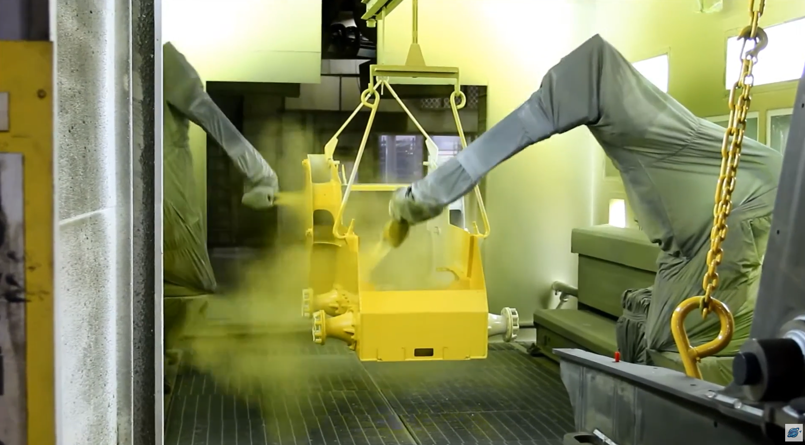
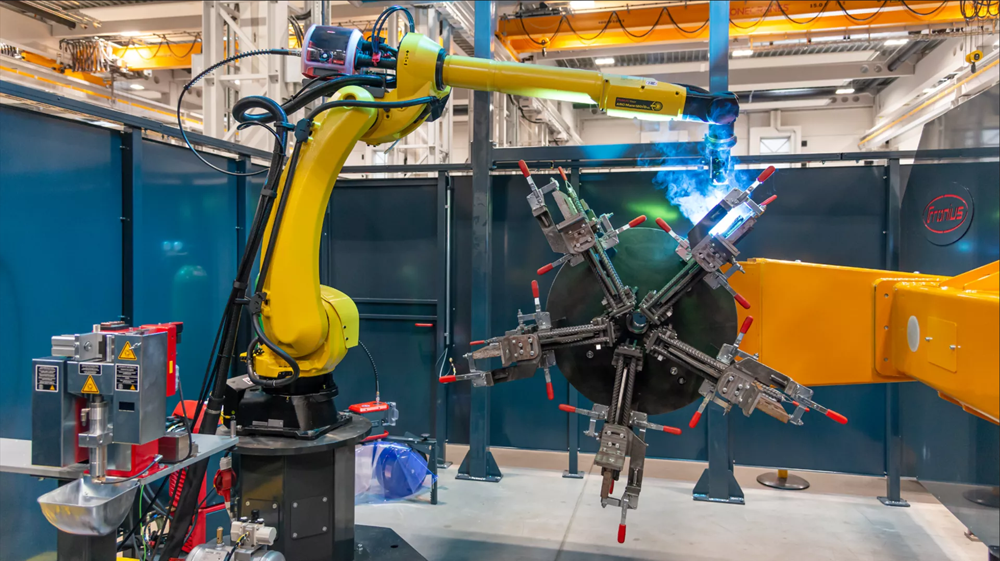

# What is a robot?

# When to use a robot?
The decision to use a robot should be based on the task, the production volume,
and the expected lifetime of the product. A robot is not automatically the best
solution just because a task can be automated. In many cases, manual work,
collaborative operation, conventional industrial robots, or fixed automation can
all solve the same production problem, but with different investment costs,
cycle times, flexibility, and safety requirements.

{#fig-breakeven}

@fig-breakeven shows this trade-off in a simplified way. The horizontal axis is
the production volume, while the vertical axis is the unit cost. Manual assembly
often has a low initial investment, but the cost per produced unit remains high
because each unit requires operator time. Robotic automation and fixed
automation normally require a larger investment at the beginning, but the unit
cost decreases when that investment is distributed over many produced units.
The break-even points show where one automation strategy becomes more economical
than another.

For low production volumes, manual assembly is often the most practical
solution. The cost of designing, purchasing, programming, guarding, and
maintaining an automated system may be difficult to justify if only a small
number of parts will be produced. Manual work is also useful when the task
requires judgement, adaptation, or handling of large product variation.

Human-robot collaboration can be useful when some parts of the task are well
suited for automation, while other parts still benefit from human flexibility.
For example, the robot may handle repetitive positioning, holding, dispensing,
or screwdriving, while the operator performs inspection, preparation, or
decision-making. This can reduce ergonomic load and improve consistency without
requiring a fully automatic production cell.

A conventional industrial robot is often a good choice when the task is
repetitive, the parts can be presented in a predictable way, and the required
production volume is large enough to justify the investment. Typical examples
include machine tending, palletizing, welding, painting, assembly, dispensing,
and pick-and-place operations. Robots are especially useful when the task is
dull, dirty, dangerous, ergonomically demanding, or requires repeatable motion
and process quality.

::: {#fig-hazardous-robot-tasks layout-ncol=2}
{#fig-painting-robots}

{#fig-welding-robot}

Examples of hazardous robot tasks.
:::

@fig-hazardous-robot-tasks illustrates why safety is part of the automation
decision, not an add-on after the robot has been installed. Painting and coating
processes can expose workers to paint mist, solvents, dust, overspray, and
controlled ventilation requirements. Welding can expose workers to arc
radiation, hot surfaces, fumes, sparks, and moving machinery. In both cases, the
robot can improve repeatability while keeping people farther away from the
hazardous part of the process.

Fixed automation is usually preferred for very high production volumes and
stable products. Dedicated machines can often achieve shorter cycle times and
lower unit costs than robots, but they are less flexible. If the product design,
process sequence, or part geometry changes, fixed automation may require major
mechanical modifications. A robot will often be slower than a purpose-built
machine, but it can be reprogrammed, retooled, and reused more easily.

In practice, a robot is most attractive in the middle region: the volume is too
high for manual work to be efficient, but the product or process is not stable
enough to justify fully dedicated fixed automation. The final decision should
include not only purchase price, but also grippers and fixtures, sensors, PLC and
safety integration, programming time, cycle time, maintenance, operator training,
floor space, and expected future product changes.
