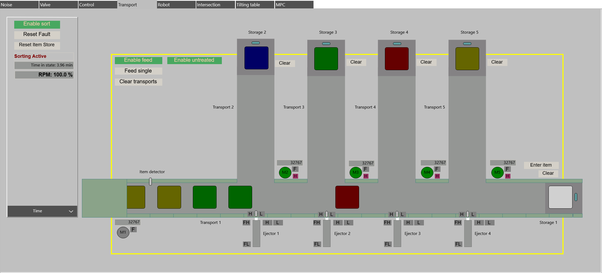
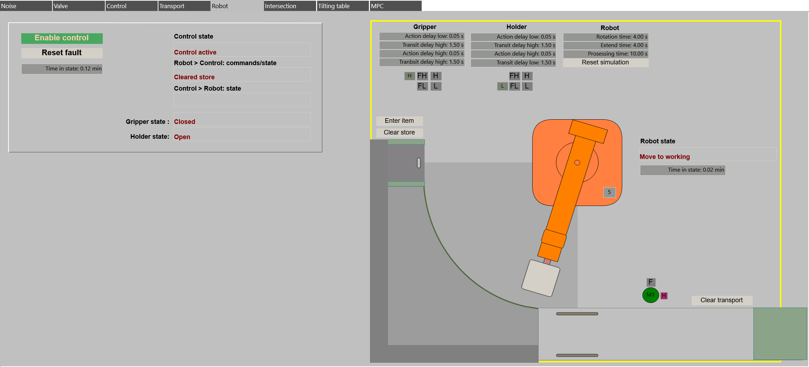

# Project purpose

This individual project brings together the main topics of the course in one
simulated production system. You will model material flow and a robot cell in
Visual Components (VC), program the robot, develop the coordinating PLC program
in CODESYS, and connect the two systems through OPC UA. The project runs
alongside the course so that concepts can be applied as they are introduced.

The objective is not only to make the simulation move. You should develop a
clear control structure, test it systematically, and use observations from the
working system to evaluate your design. The project therefore combines
implementation with engineering reasoning: what belongs in the PLC, what
belongs in VC or the robot program, how the controllers coordinate, how you
know that the system works, and what limits its performance.

| Project at a glance | Requirement |
|---|---|
| Submission | Individual |
| Deadline | 30 November |
| Project report | 50% of the final course grade |
| Oral examination | 50% of the final course grade |

# Production task

The complete system sorts a mixture of coloured and grey cylinders. Four
pusher stations route the coloured products to separate outgoing conveyors.
Grey cylinders continue to a robot cell, where a robot loads each cylinder into
a CNC mill, waits for machining, unloads it, and places the finished part on an
outgoing conveyor.

Develop the system in two connected parts:

1. Follow the [conveyor-system project](conveyor.qmd) to build and verify the
   product generation, transport, and sorting.
2. Follow the [robot-cell project](robot_cell.qmd) to design the cell, program
   and test the robot, connect the sublayouts, and introduce PLC coordination.

The detailed pages guide you through the work in a useful development order.
They define required behavior and interfaces, but many decisions about layout,
robot motions, program organization, and implementation remain yours.

# System architecture {#sec-project-architecture}

@fig-project-architecture focuses on where the two programs run and which
control data passes between them. The PLC application runs in CODESYS Control
Win SL, while Visual Components represents the plant and executes the robot
program. The arrows show commands and feedback communicated through OPC UA;
they do not represent the movement of products through the cell.

```{mermaid}
%%| label: fig-project-architecture
%%| fig-cap: "Runtime architecture and control-data flow. CODESYS Control Win SL and Visual Components run separate programs and exchange commands and feedback through OPC UA."
flowchart LR
    PLC["CODESYS Control Win SL<br/><br/>PLC state machine<br/>Overall cell coordination<br/>OPC UA server"]
    VC["Visual Components<br/><br/>OPC UA client<br/>Simulated equipment<br/>Robot program<br/>Local pusher behavior"]

    PLC -->|"Robot-operation command<br/>Conveyor run command<br/>CNC actuator requests"| VC
    VC -->|"Robot operation state<br/>Pickup-sensor state<br/>CNC feedback"| PLC
```

The required control boundary is:

| System | Required responsibility |
|---|---|
| PLC | Start and stop the ordinary conveyors, evaluate the robot-cell pickup sensor, coordinate CNC operation, request robot operations, and control the overall sequence. |
| Robot program in VC | Execute complete robot operations, including motions and gripper actions, and report the operation state to the PLC. |
| VC component behavior | Simulate products, conveyors, sensors, CNC behavior, and the local sorting and transfer behavior of the pusher conveyors. |
| OPC UA interface | Transfer the defined commands, states, actuator requests, and feedback between CODESYS and VC. |

The PLC and robot program are two interacting state machines. They coordinate
through a persistent command handshake rather than short signal pulses. The
required interface and sequence are defined in
[Two interacting state machines](robot_cell.qmd#two-interacting-state-machines)
and [Required command handshake](robot_cell.qmd#required-command-handshake).

# Development stages

Build and test the system incrementally. Each stage should provide a
known-working starting point for the next one.

1. **Conveyor system:** build the conveyor sublayout and verify product
   generation, common run control, and internal sorting.
2. **Robot cell:** build the separate robot-cell sublayout and verify the
   complete robot and CNC sequence using internal VC control.
3. **Integrated VC model:** connect the two sublayouts and verify the complete
   material flow before introducing external communication.
4. **PLC coordination:** develop the PLC state machine, implement the robot
   command interface, map the required variables through OPC UA, and commission
   one operation at a time.
5. **System evaluation:** verify repeatable operation, investigate the
   performance of the complete system, and reflect on the resulting design.

Keep checkpoint copies after the independently working conveyor, robot-cell,
and integrated VC stages. This makes later communication or control problems
easier to isolate.

# Required scope and extensions

The required project includes:

- a functional conveyor and robot-cell model in one VC layout;
- internal VC validation before external control is introduced;
- PLC coordination of the robot cell;
- PLC start and stop control of the ordinary conveyors;
- an OPC UA interface with documented signal directions;
- repeatable execution of the complete production sequence;
- a small performance study; and
- a preliminary safety review of the proposed cell.

You receive a library containing PLC elements that may be reused, but no
project-specific starter program. Select, adapt, and integrate reusable parts
only where they fit your own program structure.

The pusher system will be familiar from the CODESYS conveyor exercise: a
workpiece is detected and a sequence moves it from the main conveyor to the
correct side conveyor. In the required VC model, this sequence is not executed
by your PLC program. Each standard Pusher Conveyor component is instead
configured in VC to recognize one product type and complete the entire
diversion. Products of other types continue straight to the next station. This
is what **internal sorting and transfer behavior** means in this project.

This control boundary also reflects a technical limitation of the standard VC
component. An ordinary conveyor provides a simple run input, but the Pusher
Conveyor does not provide a corresponding external command and completion
signal for its complete product-transfer cycle. Additional interface logic
would therefore be needed before a PLC could control that cycle reliably.

The CODESYS exercise can still help you reason about the sequence while setting
up and testing the VC-internal behavior, but its PLC controller and I/O are not
reused in the project. Full PLC control of the pusher sequence is therefore not
required. The following are possible extensions after the required system
works:

- PLC control of the complete pusher sequence;
- an operator HMI;
- timeout monitoring and diagnostic messages; and
- fault detection and recovery sequences.

An extension should solve a clear problem and be tested. Additional features
do not compensate for an unreliable required sequence or an unexplained
control design.

# Provided PLC reference programs

You will receive CODESYS reference programs that can be inspected for examples
of PLC program structure, state-based control, and visualization. They are not
starter programs for the project and do not represent the required final HMI
or the final VC layout.

@fig-codesys-transport-reference shows the visualization supplied with the
conveyor exercise. Its sensors, motors, and pushers provide a useful reference
for understanding the sorting sequence and how it can be divided into control
states. In the project, however, the detailed pusher sequence runs inside the
standard VC components. The exercise's PLC controller is not connected to the
VC model, and its actuators and I/O do not directly match the project system.

{#fig-codesys-transport-reference}

The robot-cell exercise continues the same example, as shown in
@fig-codesys-robot-reference. Grey products that were not removed by a pusher
are handled by a robot in a simple machine-tending process. This makes the
exercise useful for studying how a PLC can coordinate conveyors, a robot, and
a gripper. Its simulated cell, robot operations, and I/O differ from the VC
project, however, so its controller is a conceptual reference rather than a
program to reuse directly.

{#fig-codesys-robot-reference}

# Evaluate the simulated system {#sec-project-evaluation}

Once the complete PLC-controlled system operates repeatedly, use the simulation
to answer a focused engineering question: **What currently limits the output of
the production system, and what change could improve it?**

Use the mixed product distribution to verify sorting and integration. For the
performance study, use a controlled supply of grey parts so that random and
infrequent arrivals do not dominate the behavior of the robot cell. State the
simulation condition and record only:

1. the production rate of finished parts; and
2. how the robot and CNC divide their time between working and waiting.

These two measurements are sufficient to investigate whether the robot, CNC,
or supply of parts is limiting the system. A queue length, part waiting time,
or detailed robot cycle time may be included when it helps explain the result,
but it is not an additional required measurement.

Use the VC Statistics dashboard or appropriate Statistics behaviors to obtain
the measurements. The [Visual Components statistics documentation](https://help.visualcomponents.com/5.1/Premium/en/English/Component%20Modeling/Behaviors/Misc/Statistics.htm)
and [statistics-template guide](https://academy.visualcomponents.com/app/uploads/2021/02/Using-Statistics-Templates.pdf)
describe available production-rate, utilization, state, part-count, and
part-time statistics.

Then choose one realistic change, state what effect you expect, and repeat the
test under comparable conditions. For example, the change could concern robot
placement, a motion path, process timing, conveyor speed, or buffering. Change
only what is needed to test your explanation. A detailed statistical study is
not required.

Do not treat maximum robot utilization as the objective. A robot may wait
because the CNC is the bottleneck, and making the robot faster may then have no
effect on production. Support a bottleneck claim by showing where repeated
waiting or queueing occurs and whether the tested change affects total output.
Discuss what the measurements say about the complete system rather than
presenting numbers without interpretation. The distinction between robot-level
and production-level simulation is developed in
[Cell and production-flow simulation](simulation.qmd#cell-and-production-flow-simulation).

For a brief business perspective, convert the measured production rate into an
estimated output per shift. Explain whether this would meet a stated production
target or, if no target is available, what target would be needed to judge the
capacity. Also identify information that simulation throughput alone cannot
provide, such as investment cost, demand, staffing, maintenance, availability,
or quality losses. A complete profitability calculation is not required.

Connect the evaluation to Lean Robotics by distinguishing time spent machining,
handling or transporting, and waiting based on your measurements and
observations; no additional time study is required. Explain whether the tested
change reduces waiting, unnecessary movement, or work in progress, and note any
trade-offs. The role of simulation across a Lean Robotics project is introduced
in [Simulation through a Lean Robotics project](simulation.qmd#simulation-through-a-lean-robotics-project).

# Preliminary safety review {#sec-project-safety-review}

The project does not require a complete risk assessment. Instead, identify two
or three hazardous situations in your proposed cell. Include at least one from
normal automatic operation and one from an intervention such as teaching,
clearing a blocked or dropped part, cleaning, or maintenance.

For each situation, briefly record:

| Task or situation | Hazard and possible harm | Proposed measure | What can be checked in simulation? | What requires physical verification? |
|---|---|---|---|---|
| Example: clearing a part at the CNC | Complete with your application-specific reasoning. | Complete | Complete | Complete |

Mark the relevant locations in a screenshot of your layout and explain at least
one design or safeguarding decision. Do not assign numerical risk scores or
conclude that the simulated cell has been validated as safe. The purpose is to
demonstrate task-based safety reasoning and to distinguish what a simulation can
show from what must be assessed and validated on real equipment. Use the
[robot-safety process](robot_safety.qmd#sec-risk-assessment) and its Universal
Robots e-learning activity as preparation.

# Submission

Submit the individual report together with the VC layout and CODESYS project.
The technical project files make the result reproducible, while the report must
show your own understanding and evaluation of the work.

Your implementation evidence should include:

- the internally validated conveyor and robot-cell behavior;
- the final PLC-controlled sequence;
- the PLC and robot state-machine structures;
- the OPC UA I/O list with signal directions;
- the tests used to verify important operations and interfaces; and
- the results of the performance study and preliminary safety review.

# Writing the report {#sec-project-report}

The report should explain and evaluate the solution, not reproduce every mouse
click or list the work in the order you completed it. Organize it around the
engineering questions below. You may choose your own chapter structure as long
as the reasoning remains easy to follow.

| Engineering question | What the report should communicate |
|---|---|
| What problem does the system solve? | Summarize the required material flow, important constraints, and your completed concept. Do not repeat the full project instructions. |
| Why was the cell designed this way? | Explain the layout and equipment decisions that most affected reachability, flow, control, or safety. Discuss meaningful alternatives or trade-offs rather than every placement step. |
| How is the system controlled? | Explain the division of responsibility between PLC, robot program, and VC components. Use state diagrams and the I/O contract to make the coordination and handshake understandable. |
| How do you know that it works? | Present selected tests and results for normal operation, interfaces, and important boundary conditions. Explain what each test establishes; screenshots alone are not test results. |
| What limits its performance? | Interpret the required measurements, identify the likely bottleneck, and compare the original system with one justified change. Relate the result to production flow and Lean Robotics. |
| What are the important safety concerns? | Present the preliminary safety review and distinguish simulated checks from measures that require a physical assessment and validation. |
| What did you learn from the result? | Discuss limitations, assumptions, unexpected behavior, decisions you would change, and the next improvement you would prioritize. Be specific to your system. |

Use diagrams, tables, plots, and screenshots when they provide evidence or make
the design easier to understand. Introduce each item in the text and explain
what the reader should notice. Avoid long software walkthroughs, collections of
uninterpreted screenshots, and descriptions of routine actions that do not
support an engineering decision. Complete code, detailed I/O tables, and
extensive test records can be placed in appendices.

The report is evaluated primarily on:

- correct and repeatable system behavior;
- a coherent control architecture and interface;
- justified design and implementation decisions;
- appropriate verification and use of evidence;
- **interpretation, critical reflection, and awareness of limitations;** and
- clear technical communication.

# Relation to the physical cell

Course activities may use a physical robot cell with related automation
concepts. The physical layout, robot program, controller interfaces, and I/O can
differ from the simulated project, so the VC programs and signal mappings
should not be expected to transfer directly. The transferable learning is the
method: divide responsibilities, define interfaces, program meaningful robot
operations, commission incrementally, and verify behavior. Work on the physical
cell is not part of the project assessment.
