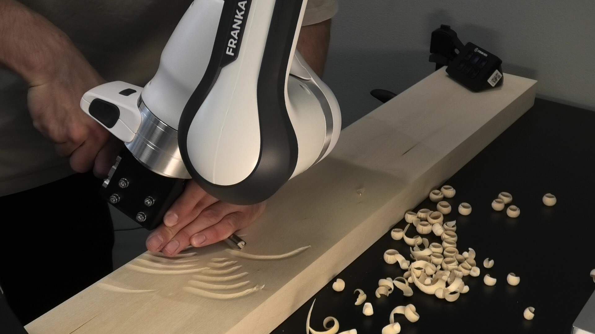

# Why robot programming matters

Robot programming is the step where an automation idea becomes an executable
sequence of robot actions. That translation is hard because human understanding
of a task is high-level, contextual, and partly implicit. A person understands
what matters in instructions such as pick the part, weld the bracket, empty the
tray, or avoid the clamp, including details that were not stated explicitly. The
robot controller cannot execute that understanding directly. It needs
deterministic, low-level instructions: target poses, coordinate frames, movement
types, speeds, tool commands, I/O signals, checks, and recovery behavior.

Different programming approaches exist because they place this translation work
in different places. In online programming, the operator creates the low-level
motion by moving the real robot. In offline programming, the translation happens
in a simulation model. In CAM-style workflows, part geometry and process
settings generate paths. In sensor-guided or learning-based systems, some of the
translation happens at run time.

Robot programming methods are often grouped into manual/direct approaches and
more automatic approaches, but the border is not sharp [@Biggs.2003;
@Heimann.2020]. In many robot cells, several methods are combined. For example,
a welding path can be created in simulation, corrected on the real robot,
selected by the PLC for a specific product type, and adjusted during execution
by a sensor that measures the actual seam position.

::: {.callout-note}
In this course we focus mainly on **offline programming, simulation, and
CAM-style robot operations** using Visual Components. The goal is not to make
you an expert in every vendor language, but to understand the programming
choices well enough to build, simulate, test, and reason about industrial robot
cells.
:::

# What a robot program contains

A robot program usually describes a sequence like this:

```text
select tool and base frame
wait until PLC says that a part is present
move to an approach pose above the part
move linearly to the pick pose
close gripper and check that the part was gripped
move away from the fixture
move to the place pose
open gripper
return to a safe waiting pose
```

Each line hides technical decisions:

- Which frame is the target pose expressed in?
- Is the move a joint move, a linear Cartesian move, or a circular/process move?
- What speed and acceleration are acceptable for the task?
- Which I/O signals must be exchanged with the PLC?
- What should happen if the part is missing, the gripper fails, or the robot
  cannot reach a pose?

These decisions rely on concepts from [frames and poses](frames_poses.qmd),
which explain how targets are described, and [kinematics](kinematics.qmd), which
explains why a target pose can lead to different joint configurations,
singularities, or unreachable motions.

# Programming approaches

Before comparing approaches, it helps to separate two things:

- A **programming approach** is the workflow used to create and maintain the
  robot's task program.
- A **teaching interface** is the way a person gives positions, paths, or
  demonstrations to the robot. Examples are teach pendants, jogging buttons,
  hand guiding, and external input devices.

Hand guiding, lead-through, and walk-through are therefore not completely
separate programming approaches. They are teaching interfaces used mainly in
online programming, and sometimes also to collect demonstrations for
learning-based methods.

ISO 10218-1:2025 is useful for the terminology. It distinguishes the robot's
built-in control program from the **task program**, which defines the specific
motion and auxiliary functions for the robot application. The standard also uses
**teach** broadly: teaching can include manually positioning the manipulator,
moving through positions with a teach pendant, programming without robot motion,
or using an external device for offline programming [@ISO10218-1.2025, secs. 3.1.4.1--3.1.4.3].

::: {.callout-note}
The descriptions below are simplified for this course. For exact definitions and
requirements, read the relevant clauses in ISO 10218-1:2025, especially the
terms for control programs, task programs, teach, teach pendants, control modes, direct/external control, and hand-guided control [@ISO10218-1.2025, secs. 3.1.3.3--3.1.3.11, 3.1.4.1--3.1.4.3,
5.2.8.4, 5.2.8.5, and 5.10.2].
:::

## Online programming

**Online programming** means programming directly on the real robot. The robot
hardware is used while the program is created and tested.

The core idea is that the operator must somehow define the robot's target poses
or motions using the real cell. This can be done by typing coordinates, jogging
the robot with a teach pendant, moving the arm by hand on a suitable robot, or
using another input device. The result is stored in the robot's task program as
poses, motion commands, tool actions, and logic. A typical pendant-based online
programming interface is shown in @fig-online-programming.

.](img/online_programming_ur.png){#fig-online-programming fig-alt="Universal Robots teach pendant used for online programming"}

### Lead-through and walk-through

One early and still relevant form of online programming is **lead-through
programming** [@Heimann.2020]. In this approach, the operator moves the robot to
important positions, often by jogging it with the teach pendant, and stores
those positions for later playback. The saved positions are then used in motion
commands such as joint moves, linear moves, approach poses, and process poses.
This works well for tasks that can be described by a manageable number of key
poses.

**Walk-through programming** is a broader term for demonstrating a motion more
directly than by typing coordinates or jogging every axis. The interface can be
hand guiding, a tracked handheld tool, a haptic device, or another input device.
Depending on the system, the demonstration can store individual poses, a path, or
process-related settings along a path.

The terminology is not completely consistent across standards, research, and
vendors. ISO 10218-1:2025 uses **teach** broadly and notes that manually
positioning the robot using hand-guided control can be referred to as
lead-through teaching [@ISO10218-1.2025, sec. 3.1.4.3]. In this course, the main
point is practical: online programming means that the real robot is used to
create or adjust the task program.

### Teaching interfaces

The simplest interface is manual entry of pose values. This can be useful when
coordinates come from a drawing, CAD model, calibration routine, or known offset.
It is precise, but it requires a good understanding of frames, units, and
orientation representation.

The teach pendant is the classic teaching interface. ISO 10218-1:2025 treats a
teach pendant as a hand-held pendant used to program, move, or actuate the robot
[@ISO10218-1.2025, sec. 3.1.3.3]. It also gives requirements for teach pendants,
including enabling functions, 3-position enabling devices, communication loss and
cable handling [@ISO10218-1.2025,
secs. 5.2.8.4 and 5.2.8.5]. With pendant jogging, the operator moves the robot
axis by axis or in Cartesian directions, then stores the current robot pose as a
program point. A KUKA teach pendant example is shown in @fig-kuka-smartpad.

.](){#fig-kuka-smartpad fig-alt="KUKA smartPAD 2 teach pendant"}

The standard distinguishes different control modes. Manual mode gives the
operator direct control and is sometimes called teach mode when program points,
logic, or attributes are being set. Automatic mode is the mode used for executing
programmed tasks [@ISO10218-1.2025, secs. 3.1.3.9--3.1.3.11]. 

Teach pendants are common for both conventional industrial manipulators and
cobots. Modern cobots often add graphical program blocks and hand-guided
teaching, while many conventional industrial robots rely more strongly on
pendant jogging unless extra equipment or safety functions for hand-guided
control are installed.

In many modern cobot systems, the teaching interface can also be physical hand
guiding. The operator activates a suitable mode and moves the robot by hand to
important poses or along a path. The short example in @fig-hand-guiding-video
shows this type of interaction.

::: {#fig-hand-guiding-video .video-embed}
```{=html}
<iframe
  src="https://www.youtube.com/embed/hCfn0mzHLyM?start=56&amp;end=89&amp;rel=0"
  title="Hand-guided robot teaching example"
  allow="accelerometer; autoplay; clipboard-write; encrypted-media; gyroscope; picture-in-picture; web-share"
  referrerpolicy="strict-origin-when-cross-origin"
  allowfullscreen>
</iframe>
```

Example of hand-guided teaching from 0:56 to 1:29. The full video is available on [YouTube](https://www.youtube.com/watch?v=hCfn0mzHLyM).
:::

Hand-guided control is common on cobots because they are often designed with
interfaces and safety functions that support physical guidance. For conventional
industrial manipulators, hand-guided control is not normally available just by
pushing the arm. It typically requires dedicated hardware or integration, for
example a guiding device or force/torque input near the end effector, and safety
functions such as monitored speed, monitored standstill, software-based limits,
hold-to-run control, and single-point-of-control logic [@ISO10218-1.2025, sec.
5.10.2].

The limitation is that a demonstrated path is often still just a recorded path.
It may repeat well when the setup is unchanged, but it does not automatically
understand the task. Hand guiding is an intuitive interface that helps the operator to quickly transfer task
knowledge to the robot, but it does not by itself create adaptive programs.
If the part moves, the fixture changes, or the process requires a different
contact force, the program needs additional mechanisms such as sensor feedback
during execution (@sec-sensor-guided-programs) or learning techniques
(@sec-robot-learning).

Online programming is effective because feedback is immediate. If a gripper
collides with a fixture or a pose is slightly wrong, the operator sees the real
problem and can correct it directly. It also does not require a complete 3D
model of the cell.

The cost is that the robot is occupied during programming. For production cells,
this often means downtime. Online programming also depends strongly on the
operator's skill. Simple pick-and-place routines can be taught quickly, but long
paths, many variants, tight tolerances, or difficult approach directions can
become slow and error-prone.

Typical strengths:

- fast for simple tasks and small changes,
- direct feedback from the real hardware,
- no detailed simulation model required,
- good for final corrections after an offline program has been transferred.

Typical limitations:

- uses the real robot during programming and testing,
- difficult for complex paths and many variants,
- quality depends on operator experience,
- mistakes can cause collisions if testing is not done carefully.

## Text-based and structured programming

Industrial robot programs are often edited in a vendor-specific language or a
structured graphical language. Examples include KUKA KRL, ABB RAPID, FANUC TP
programs, and Universal Robots programs with URScript underneath.

The syntax differs, but the basic building blocks are familiar:

```text
PTP home
LIN approach_pose
set output gripper_close = true
wait 0.3 s
LIN pick_pose
PTP place_approach
LIN place_pose
set output gripper_close = false
```

Text-based or structured programming becomes important when the task needs more
than a few stored points. Examples include:

- loops over rows, columns, and layers in a pallet pattern,
- pose offsets based on product data or camera measurements,
- conditional behavior if a part is missing,
- retries and recovery motions,
- PLC handshakes,
- custom calculations for approach poses or search motions.

The main benefit is control. The programmer can express logic, reuse functions,
and make a program adapt to variants. The drawback is that the programmer must
understand both the robot language and the physical meaning of the commands.

## Offline programming and simulation

**Offline programming** means developing and testing a robot program away from
the real robot, usually in a 3D simulation model of the cell. The real robot can
continue producing while the next program version is prepared. A typical
simulation-based OLP environment is shown in @fig-olp-simulation.

.](img/visual_components_olp5-2.png){#fig-olp-simulation fig-alt="Offline robot programming and simulation software showing a robot cell"}

A typical offline workflow is:

1. Build or import a model of the robot cell.
2. Define tools, workpieces, fixtures, frames, and I/O signals.
3. Create robot targets, paths, and cell logic in simulation.
4. Check reachability, collisions, cycle time, and robot configurations.
5. Translate the simulated program to a vendor-specific robot program with a
   postprocessor.
6. Transfer the program to the real cell and perform calibration and final corrections.

Offline programming is especially useful when robot downtime is expensive, the
program is complex, or the cell does not exist yet. It is also useful for
training because students can test ideas without risking hardware.

The weak point is model fidelity. The simulated cell must match the real cell:
robot model, tool geometry, fixture positions, workpiece position, frames, and
I/O behavior. If the model is wrong, the offline program may still require
substantial correction on the real robot. In industrial practice, offline
programs are therefore often combined with calibration, probing, manual corrections, and
commissioning tests.

## CAM-based robot programming

**Computer-aided manufacturing (CAM)** starts from part geometry and process
knowledge. Instead of manually teaching each point, the programmer selects a
manufacturing operation and the CAM software generates a toolpath. The toolpath
is then translated into machine or robot instructions by a postprocessor. The
example in @fig-cam-toolpath shows this idea for a milling operation.

.](img/cam_fusion.jpg){#fig-cam-toolpath fig-alt="Autodesk Fusion CAM view showing a milling toolpath generated from 3D part geometry"}

CAM comes from CNC machining, where it is often the main workflow: a CAD model is
used to generate machining operations, toolpaths, and machine-specific code. In
robotics, the border between CAM and offline programming is more fluid. Modern
robot OLP software often includes CAM-style functions as part of the robot-cell
workflow. The same software can model the robot cell, check reachability and
collisions, define frames and tools, and also generate process paths for tasks
such as milling, trimming, welding, dispensing, painting, deburring, or additive
manufacturing.

This means that CAM is not always a separate robot programming approach. For CNC
machines it can describe almost the whole programming chain. For robots it is
often better understood as a toolpath-generation part of an OLP workflow: CAM
creates or assists with the process path, while the robot programming
environment still has to handle robot configurations, reachability, collisions,
I/O, fixtures, calibration, and postprocessing.

The important difference is that a robot is not a CNC machine. A robot has a
large workspace and flexible orientation, but it also has lower stiffness,
singularities, joint limits, configuration choices, and a stronger dependence on
calibration. A CAM-generated path is only useful if the robot can reach it with a
safe posture, acceptable process orientation, and enough accuracy.

CAM-style path generation is powerful when the path is geometrically complex and
the setup is well controlled. It is less attractive when the task is easy to
teach directly, when parts vary unpredictably, or when the process knowledge
cannot be expressed in the software without a large engineering effort.

## Sensor-guided and parametric programs {#sec-sensor-guided-programs}

The approaches above usually create a deterministic task program: an explicit
sequence of low-level robot commands that the controller executes as written.
This works well when the cell is tightly controlled and the process is highly
repeatable. If the part, fixture, seam, contact condition, or product variant is
not known exactly when the program is created, a fixed command list can fail.

Two common ways to handle this are **sensor-guided programs** and **parametric
programs**. Both avoid writing every final robot target as a fixed value, but
they do it in different ways.

### Sensor-guided programs

In a sensor-guided program, some details of the robot motion are only defined
implicitly during programming. At run time, sensors measure the actual state of
the cell, and the program uses those measurements to compute robot actions that
fit that state.

Examples:

- A camera detects the pose of a part, and the robot computes the pick pose from
  the measured part pose.
- A welding system uses seam tracking or search motions to correct the weld path
  based on the actual seam location. This can be necessary because welding heat
  can distort the workpiece, so the seam may move away from the nominal path
  during execution.
- A force sensor detects contact and lets the robot keep a polishing, sanding,
  or assembly tool at a desired force.
- A sensor detects whether a component has reached a process position before the
  next robot action is allowed to start.

The two seam-tracking examples in @fig-optical-seam-tracking and
@fig-weld-data-seam-tracking show why the path may need to be corrected while
the robot is moving. In the optical example, an external sensor measures where
the seam is. In the second example, the correction is based on welding process
data instead of an external optical seam sensor.

::: {.video-grid}
::: {#fig-optical-seam-tracking .video-embed}
```{=html}
<iframe
  src="https://www.youtube.com/embed/pZlhQDYey08?rel=0"
  title="Optical seam tracking example"
  allow="accelerometer; autoplay; clipboard-write; encrypted-media; gyroscope; picture-in-picture; web-share"
  referrerpolicy="strict-origin-when-cross-origin"
  allowfullscreen>
</iframe>
```

Optical seam tracking example. Source: [YouTube](https://www.youtube.com/watch?v=pZlhQDYey08).
:::

::: {#fig-weld-data-seam-tracking .video-embed}
```{=html}
<iframe
  src="https://www.youtube.com/embed/SO0GmVYE_4U?rel=0"
  title="Seam tracking example using welding process data"
  allow="accelerometer; autoplay; clipboard-write; encrypted-media; gyroscope; picture-in-picture; web-share"
  referrerpolicy="strict-origin-when-cross-origin"
  allowfullscreen>
</iframe>
```

Seam tracking example using welding process data instead of a separate optical seam sensor. Source: [YouTube](https://www.youtube.com/watch?v=SO0GmVYE_4U).
:::
:::

Visual Components OLP includes search functionality for robot welding. The
Auto Search function can generate weld searches automatically, and search types
can be used to detect and correct deviations, for example for circular seams
([Auto Search](https://help.visualcomponents.com/4.9/Premium/en/English/Robot%20Programming/OLP/Auto_Search.htm),
[Circular Search](https://help.visualcomponents.com/4.8/Premium/en/English/Robot%20Programming/OLP/Circular_Search.htm)).
Visual Components also has process sensors, such as the Process Point Sensor,
that can detect components moving along a path and trigger actions in the
simulation
([Process Point Sensor](https://help.visualcomponents.com/4.9/Premium/en/English/Component%20Modeling/Behaviors/Sensors/Process_Point_Sensor.htm)).

These tools are useful for simulation and offline programming, but they do not
remove the need for real-world integration. A real sensor-guided robot cell still
needs a physical sensor, calibration, signal handling, robot-controller support,
and validation of what happens when the measurement is missing or wrong.

### Parametric programs

A parametric program is a program template that generates robot targets or
program branches from input values. The input is not necessarily measured by a
sensor at the moment of motion. It can come from the PLC, an operator panel, a
product database, a recipe, or a simulation model.

Examples:

- A palletizing program computes the target from row, column, layer, and box
  dimensions.
- A machine tending program changes approach distance and gripper settings based
  on the selected product type.
- A dispensing program changes speed, path offset, or tool settings based on a
  product variant.
- A robot program selects between predefined routines based on a PLC or process
  variable.

A concrete palletizing example is Pally, palletizing software from Rocketfarm in
Sogndal for Universal Robots cells. The user defines product, box, pallet, and
pattern data, and the software generates the palletizing behavior from those
parameters ([Rocketfarm](https://www.rocketfarm.no/software-products/palletizing/)).

A parametric program is therefore not just a final list of fixed commands. It is
closer to a small computer program that can generate the required robot commands
for a specific case. The advantage is flexibility across variants. The risk is
that the parameter logic must be tested over the full range of allowed values.

Sensor guidance and parametrization are only two ways to make a robot program
less rigid. They should not be confused with cell programming in general. Even a
simple fixed robot program can be part of a cell program if it exchanges wait,
ready, busy, start, complete, and fault signals with a PLC. The difference is
that sensor-guided and parametric programs also change the robot targets, paths,
or branches based on measured or selected input values.

## Robot learning and programming by demonstration {#sec-robot-learning}

Sensor-guided and parametric programs already move away from a completely fixed
command list. Some parts of the sequence are left open during programming and
are only filled in shortly before or during execution, for example from a camera
measurement, force signal, PLC value, or product parameter.

Robot learning takes this idea further. Instead of defining most of the command
sequence explicitly, the robot learns a behavior from data, interaction, or
demonstrations. In robot learning this behavior is often called a **policy**: a
rule or model that maps the current task state to the next robot action. The
program is therefore not only adjusted by a few parameters; larger parts of the
behavior can adapt to the current state of the task and environment.

A common industrially relevant form is **learning from demonstration** or
**programming by demonstration**. A human provides examples of the task, for
example by kinesthetic teaching, teleoperation, or motion capture. The robot then
uses those examples to reproduce or generalize the behavior [@Argall.2009]. The
kinesthetic teaching example in @fig-lfd-example can therefore be understood both
as direct path teaching and as a way to collect demonstration data.

{#fig-lfd-example fig-alt="Person physically guiding a robot during a demonstration"}

This is different from ordinary hand-guided teaching. In hand-guided record and
replay, the robot mainly repeats the shown path. In learning from demonstration,
the goal is to extract something more general, such as a movement pattern, a
contact behavior, or a policy that adapts to variations.

A modern example is a **diffusion policy**. Here the robot learns from
expert demonstrations and generates short sequences of actions from the current
visual observation. This is still learning from examples, but the result is not a
single recorded path. It is a policy that can choose actions for the situation it
currently sees [@Chi.2024].

At the current research frontier are **robot foundation models** and
**vision-language-action (VLA) models**. These models try to do for robot control
what large foundation models do for text and images: train on broad data, then
adapt to many tasks. A VLA combines camera observations, language instructions,
and robot action data, so a prompt such as place the cup in the bin can be
mapped directly to robot actions. Physical Intelligence's pi0 family is one
example. Their recent pi0.7 model is trained with diverse prompts and data from
many sources, and is intended to generalize across robots, scenes, and tasks
[@Black.2024; @PhysicalIntelligence.2026]. The examples in
@fig-diffusion-policy-video and @fig-pi-foundation-model-video show how far this
is from replaying a fixed path.

::: {.video-grid}
::: {#fig-diffusion-policy-video .video-embed}
```{=html}
<video controls muted playsinline preload="metadata">
  <source src="https://diffusion-policy.cs.columbia.edu/videos/mug_flipping_20_web.mp4" type="video/mp4">
</video>
```

Diffusion Policy mug flipping experiment: a learned visuomotor policy generates robot actions from visual observations. Source: [Diffusion Policy project page](https://diffusion-policy.cs.columbia.edu/).
:::

::: {#fig-pi-foundation-model-video .video-embed}
```{=html}
<video controls muted playsinline preload="metadata">
  <source src="https://website.pi-asset.com/pi07/Pi07VFINAL.mp4" type="video/mp4">
</video>
```

Physical Intelligence pi0.7 example: a robot foundation model demonstrated on several dexterous tasks. Source: [Physical Intelligence](https://www.pi.website/blog/pi07).
:::
:::

These approaches are among the most powerful current directions in robot
learning, but they are not yet a normal replacement for conventional industrial
robot programming. For production use, the open questions are still serious:
validation, safety, failure handling, data collection, cycle time, certification,
and integration with PLCs, tools, fixtures, and existing robot controllers.

The promise is clear: easier programming for tasks that are hard to describe in
rules, especially tasks involving contact, variation, or expert manual skill.
The challenge is also clear: learned behavior must be validated carefully before
it is trusted in production. Demonstrations can be inconsistent, training data
may not cover all important cases, and learned models can be difficult to inspect
or modify compared with conventional robot code.

Reinforcement learning is another robot learning approach. Here the robot learns
by trial and error using rewards. It is powerful in research and simulation, but
it is still uncommon in everyday industrial robot cells because training,
validation, safety, and sim-to-real transfer are difficult.

# Choosing a programming approach

The best programming method depends on the task, the production situation, and
the people who will maintain the cell.

| Approach or method | Good fit | Strengths | Main limitations |
|---|---|---|---|
| Online programming with teach pendant or hand guiding | Simple handling tasks, final corrections, commissioning | Direct feedback, no cell model needed | Robot downtime, slower for complex paths |
| Text-based / structured programming | Variants, loops, PLC handshakes, recovery logic | Flexible and explicit | Requires programming and robot knowledge |
| Offline programming / simulation | Complex cells, expensive downtime, virtual commissioning | Test before hardware, minimized downtime, collision checks, cycle-time estimates | Needs accurate models and calibration |
| CAM-style programming | Path-heavy manufacturing operations | Efficient generation of complex toolpaths | Needs process formalization, postprocessing, calibration |
| Sensor-guided programming | Variable part poses, adaptive handling, inspection | Adapts to real conditions | Adds sensor calibration, data handling, failure cases |
| Learning from demonstration | Hard-to-model tasks, demonstrations of expert skill | Potentially intuitive and adaptive | Validation, safety, and reliability are challenging |
| Robot foundation models / VLAs | Research frontier, general-purpose robot behavior | Can combine vision, language, and action data across tasks | Not yet mature for ordinary industrial deployment |

The table only compares how robot motions are created. In a real robot cell,
this is only one part of the program. The robot still has to coordinate with
workpieces, grippers, fixtures, sensors, safety functions, the PLC, error
handling, and recovery behavior. For example, a weld path may be generated by
CAM, but the cell program must still decide when the part is clamped, when
welding starts, what happens if the arc fails, and when the robot is allowed to
move to the next step.

Many practical systems therefore use mixed approaches. A learned routine may be
called from a structured robot program, while PLC signals still decide when the
routine is allowed to start and what should happen afterwards. Similarly, a
camera may compute a pick pose, but the surrounding program still handles tool
commands, checks, and recovery. Future foundation-model systems may process more
of these signals directly, but ordinary industrial cells still usually separate
motion generation from cell coordination.

The robot controller is also a real constraint. In production, the feasible
programming approach must fit what the vendor controller, safety functions,
fieldbus interfaces, and offline programming tools support. ROS 2 offers another
path because it gives more freedom to design controllers, perception pipelines,
and programming interfaces, but not all industrial robots support ROS 2 natively,
and it is still less common in everyday industrial deployment than its technical
capabilities would suggest.

# Practical checklist

Instead of following one fixed workflow, use the programming approach as an
engineering choice. For any robot task, ask the same practical questions:

- What must the robot physically do: move a part, follow a process path, inspect
  something, or react to contact?
- Which information is known when the program is written, and which information
  is only known shortly before or during execution?
- Which poses and frames are needed, and how will they be calibrated or checked?
- Where should the motion come from: online teaching, structured code, offline
  simulation, CAM, sensor measurements, parameters, or learning?
- What does the robot controller actually support: vendor language, motion
  types, postprocessors, fieldbus communication, sensor interfaces, hand-guided
  control, external control, or ROS 2?
- How does the robot coordinate with the rest of the cell: grippers, tools,
  fixtures, PLC signals, safety functions, and recovery behavior?
- How will the program be validated: in simulation, on the real robot, for edge
  cases, and after calibration changes?

Most programming problems come from ignoring one of these questions. Typical
examples are targets stored in the wrong frame, a CAM path that the robot cannot
reach with a safe posture, a sensor-guided routine without a clear failure case,
or a robot program that moves correctly but does not coordinate properly with the
PLC and safety system.

# Exercises

1. Choose one task, for example palletizing, welding, machine tending, or glue
   dispensing. Compare at least two programming approaches for the task. Which
   one would you choose first, and why?
2. For the same task, identify what is fixed when the program is written, what
   could be selected from parameters, and what may need to be measured by a
   sensor at run time.
3. List the frames, tools, and workpiece data that the program would need.
4. Identify one part of the task that could be taught online and one part that
   would be better generated offline, by CAM, or parametrically.
5. Pick one approach that depends on controller support. Which vendor functions,
   fieldbus signals, postprocessors, sensor interfaces, or ROS 2 interfaces would
   have to be available?
6. In an offline simulation or CAM workflow, what information must match the real
   cell before you would trust the generated program?
7. Consider a camera-guided pick task or a seam-tracking welding task. What data
   must pass between the sensor system, robot program, and PLC? What should the
   cell do if the measurement is missing or unreasonable?
8. Open ISO 10218-1:2025 and compare the terms **teach**, **teach pendant**,
   **manual mode**, and **automatic mode**. Which of these terms describe a
   programming activity, and which describe a control state or device?
9. Use ISO 10218-1:2025, clause 5.10.2, to list three safety functions or design
   requirements that matter when hand-guided control is used. Would they be
   relevant for a cobot, a conventional industrial manipulator, or both?

# Further reading

- Biggs and MacDonald provide a broad survey of robot programming systems and
  useful terminology [@Biggs.2003].
- Heimann and Guhl review industrial robot programming methods with a focus on
  manufacturing tasks [@Heimann.2020].
- Argall et al. survey learning from demonstration in robotics [@Argall.2009].
- Chi et al. introduce Diffusion Policy as a modern visuomotor learning approach
  based on action diffusion [@Chi.2024].
- Black et al. and Physical Intelligence describe recent VLA and robot foundation
  model work [@Black.2024; @PhysicalIntelligence.2026].
- Bouchard gives a practical production-oriented view of how to make robot cells
  work in factories [@Bouchard.2017].
