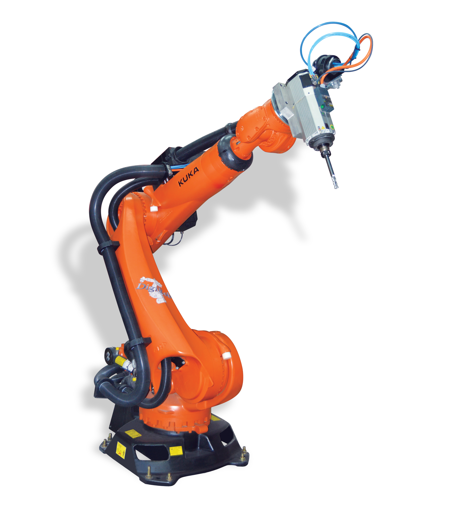

# What is a robot?
> A robot is a goal-oriented machine that can sense, plan, and act
> [@Corke.2023].

This definition is useful because it separates a robot from a simple machine
that only repeats one fixed motion. A robot receives information from sensors,
uses a controller to decide what motion or action should happen next, and then
acts on the physical world through motors, tools, or grippers.

Robots can be divided into two broad categories: mobile robots and
manipulators. Mobile robots move through an environment. Examples include
autonomous ground vehicles, aerial vehicles, and underwater vehicles.
Manipulators are robot arms. They are designed to move a tool, sensor, gripper,
or workpiece to a desired position and orientation. In this course, the focus is
on manipulators, and especially on industrial robot arms used in manufacturing.

An industrial robot arm can be understood as a programmable multi-axis motion
generator. Mechanically, it consists of links connected by joints. Each joint is
driven by a motor, often through a gearbox, and the joint positions are measured
with sensors such as encoders. The robot controller coordinates all the joints so
that the end of the robot follows the desired path. Without this coordination,
the robot would only be a collection of motors and metal parts.

This is different from a purpose-built machine, which may also use motors,
sensors, and control logic to generate motion and react to its environment. A
purpose-built machine is normally designed for a specific process and a limited
set of motion paths. A manipulator is deliberately more generic: it is designed
to reach as many positions and orientations as possible within its working
range, so it can be reused for different tools, products, and tasks.

# Basic robot anatomy

@fig-robot-anatomy introduces the basic names used for an industrial robot arm.
We will use these terms throughout the course.

::: {#fig-robot-anatomy .robot-anatomy-figure}
```{=html}
<div class="robot-anatomy-figure__canvas">
  
  <svg viewBox="0 0 2362 2598" aria-hidden="true">
    <defs>
      <marker id="robot-anatomy-arrow-blue" markerWidth="8" markerHeight="8" refX="6.5" refY="3" orient="auto" markerUnits="strokeWidth">
        <path d="M 0 0 L 6.5 3 L 0 6 z" fill="#1d4f8e"></path>
      </marker>
      <marker id="robot-anatomy-arrow-teal" markerWidth="8" markerHeight="8" refX="6.5" refY="3" orient="auto" markerUnits="strokeWidth">
        <path d="M 0 0 L 6.5 3 L 0 6 z" fill="#0f766e"></path>
      </marker>
      <marker id="robot-anatomy-arrow-orange" markerWidth="8" markerHeight="8" refX="6.5" refY="3" orient="auto" markerUnits="strokeWidth">
        <path d="M 0 0 L 6.5 3 L 0 6 z" fill="#c2410c"></path>
      </marker>
    </defs>

    <g class="robot-anatomy__callouts robot-anatomy__callouts--base">
      <path class="robot-anatomy__leader robot-anatomy__leader--blue" d="M 300 2430 L 700 2350"></path>
      <text class="robot-anatomy__label robot-anatomy__label--blue" x="115" y="2445">base</text>

      <g class="robot-anatomy-frame robot-anatomy-frame--base" transform="translate(785 2195)">
        <line class="robot-anatomy-frame__axis robot-anatomy-frame__axis--x" x1="0" y1="0" x2="130" y2="35" marker-end="url(#robot-anatomy-arrow-blue)"></line>
        <line class="robot-anatomy-frame__axis robot-anatomy-frame__axis--y" x1="0" y1="0" x2="-95" y2="48" marker-end="url(#robot-anatomy-arrow-teal)"></line>
        <line class="robot-anatomy-frame__axis robot-anatomy-frame__axis--z" x1="0" y1="0" x2="0" y2="-150" marker-end="url(#robot-anatomy-arrow-orange)"></line>
        <circle class="robot-anatomy-frame__origin" cx="0" cy="0" r="13"></circle>
        <text class="robot-anatomy__label robot-anatomy__label--blue" x="105" y="-125">base frame</text>
      </g>
    </g>

    <g class="robot-anatomy__joints">
      <circle class="robot-anatomy__dot robot-anatomy__dot--joint" cx="790" cy="2105" r="15"></circle>
      <path class="robot-anatomy__leader robot-anatomy__leader--teal" d="M 1110 2100 L 815 2110"></path>
      <text class="robot-anatomy__label robot-anatomy__label--teal" x="1130" y="2115">J1</text>

      <circle class="robot-anatomy__dot robot-anatomy__dot--joint" cx="610" cy="1810" r="15"></circle>
      <path class="robot-anatomy__leader robot-anatomy__leader--teal" d="M 340 1845 L 590 1815"></path>
      <text class="robot-anatomy__label robot-anatomy__label--teal" x="245" y="1860">J2</text>

      <circle class="robot-anatomy__dot robot-anatomy__dot--joint" cx="1065" cy="930" r="15"></circle>
      <path class="robot-anatomy__leader robot-anatomy__leader--teal" d="M 1370 910 L 1088 930"></path>
      <text class="robot-anatomy__label robot-anatomy__label--teal" x="1390" y="925">J3</text>
      <text class="robot-anatomy__label robot-anatomy__label--dark" x="1390" y="985">elbow</text>

      <circle class="robot-anatomy__dot robot-anatomy__dot--joint" cx="1515" cy="650" r="15"></circle>
      <path class="robot-anatomy__leader robot-anatomy__leader--teal" d="M 1320 520 L 1500 635"></path>
      <text class="robot-anatomy__label robot-anatomy__label--teal" x="1220" y="520">J4</text>

      <circle class="robot-anatomy__dot robot-anatomy__dot--joint" cx="1640" cy="545" r="15"></circle>
      <path class="robot-anatomy__leader robot-anatomy__leader--teal" d="M 1840 455 L 1660 535"></path>
      <text class="robot-anatomy__label robot-anatomy__label--teal" x="1860" y="465">J5</text>

      <circle class="robot-anatomy__dot robot-anatomy__dot--joint" cx="1670" cy="735" r="15"></circle>
      <path class="robot-anatomy__leader robot-anatomy__leader--teal" d="M 1990 760 L 1692 738"></path>
      <text class="robot-anatomy__label robot-anatomy__label--teal" x="2010" y="775">J6</text>
      <text class="robot-anatomy__label robot-anatomy__label--dark" x="1845" y="645">wrist</text>
    </g>

    <g class="robot-anatomy__links">
      <path class="robot-anatomy__leader robot-anatomy__leader--blue" d="M 1160 1970 L 790 1935"></path>
      <text class="robot-anatomy__label robot-anatomy__label--blue" x="1180" y="1985">link 1</text>

      <path class="robot-anatomy__leader robot-anatomy__leader--blue" d="M 380 1325 L 755 1415"></path>
      <text class="robot-anatomy__label robot-anatomy__label--blue" x="250" y="1335">link 2</text>

      <path class="robot-anatomy__leader robot-anatomy__leader--blue" d="M 1450 725 L 1260 760"></path>
      <text class="robot-anatomy__label robot-anatomy__label--blue" x="1470" y="740">link 3</text>

      <path class="robot-anatomy__leader robot-anatomy__leader--blue" d="M 1420 415 L 1535 560"></path>
      <text class="robot-anatomy__label robot-anatomy__label--blue" x="1280" y="410">link 4</text>

      <path class="robot-anatomy__leader robot-anatomy__leader--blue" d="M 1990 610 L 1660 700"></path>
      <text class="robot-anatomy__label robot-anatomy__label--blue" x="2010" y="620">link 5</text>
    </g>

    <g class="robot-anatomy__tooling">
      <path class="robot-anatomy__leader robot-anatomy__leader--orange" d="M 1950 845 L 1680 760"></path>
      <text class="robot-anatomy__label robot-anatomy__label--orange" x="1970" y="860">flange</text>

      <path class="robot-anatomy__leader robot-anatomy__leader--orange" d="M 1880 1095 L 1730 970"></path>
      <text class="robot-anatomy__label robot-anatomy__label--orange" x="1900" y="1110">TCP frame</text>

      <g class="robot-anatomy-frame robot-anatomy-frame--tcp" transform="translate(1730 970)">
        <line class="robot-anatomy-frame__axis robot-anatomy-frame__axis--x" x1="0" y1="0" x2="120" y2="-42" marker-end="url(#robot-anatomy-arrow-blue)"></line>
        <line class="robot-anatomy-frame__axis robot-anatomy-frame__axis--y" x1="0" y1="0" x2="-92" y2="-64" marker-end="url(#robot-anatomy-arrow-teal)"></line>
        <line class="robot-anatomy-frame__axis robot-anatomy-frame__axis--z" x1="0" y1="0" x2="38" y2="142" marker-end="url(#robot-anatomy-arrow-orange)"></line>
        <circle class="robot-anatomy-frame__origin" cx="0" cy="0" r="12"></circle>
      </g>
    </g>
  </svg>
</div>
```

Basic anatomy of a six-axis industrial robot arm with a milling spindle mounted as the tool. The exact mechanical shape depends on the robot model and the mounted tool, but the terms base, base frame, joints, links, elbow, wrist, flange, and TCP frame are used in most robot applications.
:::

A robot arm is built from **links** connected by **joints**. The joints are the
controlled axes of the robot. When a six-axis industrial arm moves, the
controller coordinates all six joint positions so the end of the robot reaches
the desired pose.

The **base frame** is the coordinate frame attached to the robot base. Robot
targets are often ultimately interpreted relative to this frame. The idea of
coordinate frames is explained more carefully on the [frames and poses](frames_poses.qmd)
page.

The **flange** is the mechanical mounting interface at the end of the robot arm.
The robot manufacturer normally defines a flange frame there. A **tool** or
**end-effector** is mounted to the flange. The coordinate frame attached to the
tool is often called the **tool frame** or **end-effector frame**. Examples of
end-effectors are grippers, welding torches, screwdrivers, cameras, dispensing
nozzles, or milling spindles.

The **TCP**, or **tool center point**, is the point on the tool that the robot is
programmed to move. For a gripper, the TCP may be between the fingers. For a
milling spindle, it may be at the tool tip. For a welding torch, it is typically
near the wire or arc position. The TCP is not necessarily located at the flange;
it is defined by the tool geometry. Correct TCP definition is essential because
linear moves, process paths, and programmed target poses refer to the TCP, not to
the outside shape of the robot.

The robot pose, TCP, flange frame, tool frame, and base frame are closely related
to the kinematics topics covered later in [kinematics](kinematics.qmd). For now,
it is enough to know that the robot controller uses the joint values and the tool
TCP definition to calculate where the tool is in space.

# Conventional industrial manipulators and cobots

A **conventional industrial manipulator** is usually designed for high speed,
high repeatability, high payload, or harsh industrial processes. It is often used
inside a guarded cell where people are kept outside the hazardous workspace while
the robot runs automatically. Typical examples are welding, painting, machine
tending, palletizing, dispensing, and material handling.

A **collaborative robot**, often called a **cobot**, is still a manipulator, but
it is designed and integrated for applications where people may work closer to
the robot. Cobots often have force or torque sensing, rounded shapes, easier
hand-guided teaching, and safety functions for monitored speed or power-and-force
limiting. This does not mean a cobot is automatically safe in every application.
The tool, workpiece, speed, payload, fixtures, and task hazards still determine
what safety measures are required.

The difference is therefore not only mechanical. It is also about the intended
application and the safety concept. A conventional industrial robot can sometimes
be used in collaborative applications if the full cell is designed and validated
for it, and a cobot can still require guarding if it carries a sharp tool, a hot
part, or a dangerous process.

A complete robot cell includes more than the robot arm. It also needs a way to
present parts to the robot and remove them after processing. Depending on the
application, the cell may include fixtures, conveyors, feeders, sensors,
grippers, safety equipment, a robot controller, and a PLC or other controller
that coordinates the full process.

The internal construction of industrial robot axes can be seen in these
examples:

- [Inside a KUKA robot](https://www.youtube.com/watch?v=iRKDfknqtbc)
- [Inside a UR robot axis](https://www.youtube.com/watch?v=oje2ucwe3vI)

# When to use a robot?
The decision to use a robot should be based on the task, the production volume,
and the expected lifetime of the product. A robot is not automatically the best
solution just because a task can be automated. In many cases, manual work,
collaborative operation, conventional industrial robots, or fixed automation can
all solve the same production problem, but with different investment costs,
cycle times, flexibility, and safety requirements.

Robot automation is already widely used in industry. The IFR World Robotics
2025 report states that 542,000 industrial robots were installed worldwide in
2024, with a global operational stock of about 4.66 million units [@IFR.2025].
The important engineering question is therefore where robots are technically and
economically the right automation strategy.

{#fig-breakeven}

@fig-breakeven shows this trade-off in a simplified way. The horizontal axis is
the production volume, while the vertical axis is the unit cost. Manual assembly
often has a low initial investment, but the cost per produced unit remains high
because each unit requires operator time. Robotic automation and fixed
automation normally require a larger investment at the beginning, but the unit
cost decreases when that investment is distributed over many produced units.
The break-even points show where one automation strategy becomes more economical
than another.

For low production volumes, manual assembly is often the most practical
solution. The cost of designing, purchasing, programming, guarding, and
maintaining an automated system may be difficult to justify if only a small
number of parts will be produced. Manual work is also useful when the task
requires judgement, adaptation, or handling of large product variation.

Human-robot collaboration can be useful when some parts of the task are well
suited for automation, while other parts still benefit from human flexibility.
For example, the robot may handle repetitive positioning, holding, dispensing,
or screwdriving, while the operator performs inspection, preparation, or
decision-making. This can reduce ergonomic load and improve consistency without
requiring a fully automatic production cell.

A conventional industrial robot is often a good choice when the task is
repetitive, the parts can be presented in a predictable way, and the required
production volume is large enough to justify the investment. Typical examples
include machine tending, palletizing, welding, painting, assembly, dispensing,
and pick-and-place operations. Robots are especially useful when the task is
dull, dirty, dangerous, ergonomically demanding, or requires repeatable motion
and process quality.

::: {#fig-hazardous-robot-tasks layout-ncol=2}
](img/painting_robots.png){#fig-painting-robots}

](img/welding_robot.png){#fig-welding-robot}

Examples of hazardous robot tasks.
:::

@fig-hazardous-robot-tasks illustrates why safety is part of the automation
decision, not an add-on after the robot has been installed. Painting and coating
processes can expose workers to paint mist, solvents, dust, overspray, and
controlled ventilation requirements. Welding can expose workers to arc
radiation, hot surfaces, fumes, sparks, and moving machinery. In both cases, the
robot can improve repeatability while keeping people farther away from the
hazardous part of the process.

Fixed automation is usually preferred for very high production volumes and
stable products. Dedicated machines can often achieve shorter cycle times and
lower unit costs than robots, but they are less flexible. If the product design,
process sequence, or part geometry changes, fixed automation may require major
mechanical modifications. A robot will often be slower than a purpose-built
machine, but it can be reprogrammed, retooled, and reused more easily.

In practice, a robot is most attractive in the middle region: the volume is too
high for manual work to be efficient, but the product or process is not stable
enough to justify fully dedicated fixed automation. The final decision should
include not only purchase price, but also grippers and fixtures, sensors, PLC and
safety integration, programming time, cycle time, maintenance, operator training,
floor space, and expected future product changes.

# Lean Robotics

TODO: Write about @Bouchard.2017 and the Lean Robotics principles, and how they can be used to make better decisions about when to use a robot, and how to design and implement robotic automation in a way that is more efficient, flexible, and sustainable.