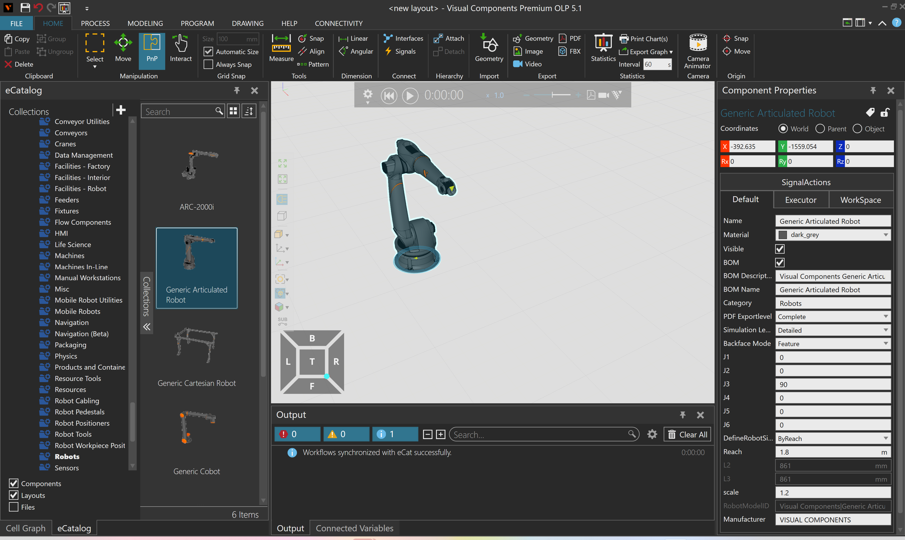
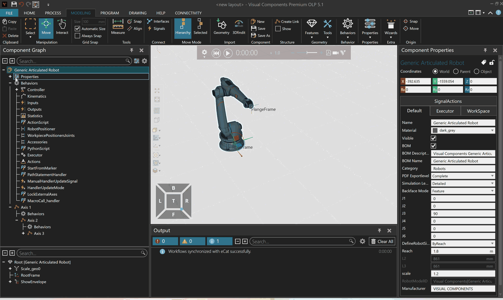

# Learning Visual Components

Visual Components (VC) is the main simulation environment used in this course.
It combines layout design, production-flow simulation, robot programming,
offline programming (OLP), component modeling, analysis tools, and connections
to external control systems. We use **Visual Components Premium OLP 5.1**. The
[simulation page](simulation.qmd) discusses why such tools are useful; this
page introduces the concepts and workflows needed to use VC effectively.

VC contains far more functionality than we can cover in one course. The
[Visual Components Academy](https://academy.visualcomponents.com/) provides
many useful learning paths and lessons, and you are welcome to explore them.
They are not all required course material. We have selected the lessons that
best support the course topics and project work and placed them after the
sections where they are most useful. Some were recorded in earlier VC versions,
so individual buttons or panels may look different, but the main concepts and
workflows remain relevant. A **recommended lesson** covers core preparation, a
**project lesson** is most useful when you reach the related project stage, and
an **optional extension** goes beyond what is required in the course.

This page is not intended as a fine-grained sequence of every mouse click.
Learning VC is most effective when you combine the explanations and curated
lessons with time spent exploring the software yourself. Try components,
settings, connections, and layouts, and see how the simulation responds. Do
not be afraid to play around: this is not wasted time, but an important part of
becoming comfortable with VC and discovering what its tools can do.

When you use VC for a specific task, the discussion of
[models built for a purpose](simulation.qmd#sec-simulation-purpose) helps you
decide which parts and details the model actually needs. Use the
[complete robot-simulation learning path](https://academy.visualcomponents.com/learning-paths/using-visual-components-for-robot-simulation/)
and the [VC help system](https://help.visualcomponents.com/5.0/Premium/en/English/Help.htm)
when you need more detail than this course requires.

# Layouts and components {#sec-vc-layouts-components}

A VC **layout** is the working model of a simulated system. It contains the
equipment, products, robot programs, process definitions, signal connections,
and other configuration needed to run the simulation. Most equipment is added
from the **eCatalog**, which contains ready-made models from Visual Components
and equipment manufacturers.

@fig-vc-main-window shows the main VC workspace. Components are found in the
eCatalog on the left and placed in the 3D view in the centre. The selected
component's properties appear on the right, while messages and diagnostic
information appear in the Output panel below the 3D view. The ribbon tabs at
the top expose tools for layout work, modeling, robot programming, drawing, and
connectivity.

{#fig-vc-main-window width=100% fig-alt="Visual Components Premium OLP 5.1 showing the ribbon, eCatalog, a robot in the 3D view, Component Properties, Output panel, and Cell Graph tab."}

A component is more than its visible 3D geometry. A conveyor must know how to
move products, a sensor must know what to detect, and a robot must contain a
kinematic model and a program executor. The following terms help explain how a
VC component provides this functionality:

| Term | Practical meaning | Example |
|---|---|---|
| **Component** | One reusable item placed in a layout. | A conveyor, robot, sensor, gripper, or machine. |
| **Property** | A value that configures an item or reports its current state. | Conveyor speed, pedestal height, or process time. |
| **Behavior** | Internal functionality that makes a component act during simulation. | A path moves products, a sensor detects them, and a script implements logic. |
| **Interface** | A defined connection point between compatible components. | A conveyor end, robot flange, or connection that bundles signals. |
| **Signal** | A value communicated during simulation. | A Boolean `PartDetected` signal or an integer command. |

The **Cell Graph** and **Component Graph** serve different purposes:

- The Cell Graph organizes the components placed in the complete layout and
  shows which components are attached to one another. It also helps you move
  components into **sublayouts**, which are named groups used to organize parts
  of a larger model, such as the conveyor system and robot cell.
- The Component Graph exposes the internal structure and behaviors of one
  selected component. You do not normally need to understand every behavior in
  an eCatalog model, but this graph is useful when you need to find a signal,
  inspect how a component works, or expose additional data for external control.

The animation in @fig-vc-component-graph expands and scrolls through the
Component Graph of the robot shown in @fig-vc-main-window. Notice how
properties and behaviors belong either to the complete robot or to individual
parts such as its axes. The aim is not to understand every item in the tree,
but to recognize the structure and know where component internals can be
inspected when needed.

{#fig-vc-component-graph width=100% fig-alt="Animated screen recording that expands and scrolls through the Component Graph of a generic articulated robot in Visual Components."}

The Cell Graph tab is visible at the lower left of @fig-vc-main-window. The
[robot-cell project](robot_cell.qmd#sec-cell-sublayouts) uses
sublayouts to keep the conveyor system and robot cell manageable while they are
developed in one simulation.

**Project lesson:** [Managing larger simulations with sublayouts](https://academy.visualcomponents.com/lessons/managing-larger-simulations-with-sub-layouts/)
demonstrates how to create sublayouts and use them to select, move, copy, and
organize groups of components. Use it when separating the conveyor system and
robot cell within the common project layout.

The [VC behavior overview](https://help.visualcomponents.com/4.9/Premium/en/English/Component%20Modeling/Behaviors/Behaviors.htm)
describes the main behavior families.

## Interfaces, PnP, and signals {#sec-vc-interfaces}

Interfaces define which components can connect and what the connection does.
A physical interface can establish a parent-child relationship and align two
components. With **plug-and-play (PnP)**, compatible interfaces guide the
components together and make them snap into place. This is commonly used for
conveyors, sensors, robot tools, and robot positioners.

Other interfaces are logical rather than physical. They can connect signals,
material-flow behavior, robot tools, or other functionality without moving the
components. A signal is the value that travels through such a connection; the
interface defines how the connection can be made. VC supports Boolean, integer,
real, string, matrix, and component-valued signals, although Boolean and
integer signals cover most work in this course.

Properties and signals should not be confused. A property often configures a
component, while a signal is intended to communicate a changing value during
simulation. The distinction is not absolute because component scripts can read
and write properties, but a visible property is not automatically an externally
connected signal.

**Recommended lesson:** [Signals in simulation](https://academy.visualcomponents.com/lessons/signals-in-simulation-2/)
builds a small conveyor line and demonstrates how to connect and use component
signals with the **Connect Signals** tool. Focus on the direction of the
connection. After the lesson, you should be able to connect one component's
Boolean output to another component's input and explain the direction of the
information flow.

# Products and production flow {#sec-vc-products-flow}

In VC, the word **product** has a specific role in production simulation. A
product type defines what can be created, while a product instance is one
particular item that exists and moves during a simulation. A product type can
refer to a component model for its visible geometry and can also contain data
used by processes, filtering, and routing.

The **Product Type Editor** is used to create and organize product types. It is
important to distinguish a product's appearance from its simulation identity:
changing the color or material of a 3D component does not by itself define a
new product type or process route. A feeder or product creator must be
configured to generate the intended product types.

Every product type belongs to a **flow group**. Product types in the same flow
group share a production-flow sequence and can use the same compatible
transport links. For example, several variants of a workpiece could pass
through the same machining and inspection steps while still carrying different
product properties. The **Process Flow Editor** defines the sequence of process
steps for the group.

The [Product Type Editor documentation](https://help.visualcomponents.com/4.9/Premium/en/English/Process%20Modeling/Product_Type_Editor.htm)
and [Process Flow Editor documentation](https://help.visualcomponents.com/5.0/Premium/en/English/Process%20Modeling/Process_Flow_Editor.htm)
provide the detailed reference for these tools.

**Optional extension:** [Introduction to Layout Configuration](https://academy.visualcomponents.com/lessons/introduction-to-layout-configuration/)
develops a layout with products, processes, and material flow. It covers more
process modeling than is needed for every course exercise, but it is the most
useful selected resource when you need to understand how product definitions
and flow steps turn a collection of components into a production simulation.

# Robots in Visual Components {#sec-vc-robots}

A VC robot component combines the robot geometry, joint and kinematic model,
base and tool frames, motion solver, robot program, and I/O ports. This allows
VC to calculate and display robot motion while executing a structured program.
It does not mean that the simulated controller behaves identically to every
real controller; vendor-specific offline programming and virtual-controller
workflows add another layer, as discussed on the
[robot-programming page](robot_programming.qmd).

## Jogging and teaching motion {#sec-vc-robot-teaching}

The **Jog** tool moves the selected robot interactively. You can jog individual
joints or move the active TCP in Cartesian coordinates, using the selected base
and tool frames. The concepts behind these choices are introduced on the
[frames and poses](frames_poses.qmd) and [kinematics](kinematics.qmd) pages.

Basic robot programming in VC follows the same key-point logic used with many
industrial robots. Jog the robot to the required final pose and add a motion
statement. The statement stores the target pose and movement type. During
execution, it moves from the preceding program state to that target. The chosen
movement type determines whether the controller plans mainly in joint space or
constrains the TCP to a Cartesian path.

This approach is suitable for taught pick, place, approach, and retract poses.
Path-heavy tasks can instead use geometry-based path tools and offline
programming workflows; those approaches are introduced on the
[robot-programming page](robot_programming.qmd#offline-programming-and-simulation).

**Recommended lesson:** [Introduction to Robot Teaching](https://academy.visualcomponents.com/lessons/introduction-to-robot-teaching/)
introduces the Program tab, motion points, jogging, editing taught points,
signal actions, exchanging a robot, and adding a tool. Watch how a motion is
defined by jogging to its target and then creating or updating a statement.
Afterwards, you should be able to teach and modify a short sequence of robot
motions.

**Recommended lesson:** [Basics of Robotics](https://academy.visualcomponents.com/lessons/basics-of-robotics/)
connects the VC controls to point-to-point and linear motion, base and tool
frames, robot configurations, and joint turns. Use it together with the course
theory pages rather than treating the software labels as a replacement for the
underlying concepts. You should be able to explain how changing the movement
type, active frame, or robot configuration changes the resulting motion.

## Program structure and logic {#sec-vc-robot-programs}

Robot programs in VC are organized into routines containing statements. Motion
statements define robot movement, I/O statements communicate with the cell,
and call statements execute another routine. Conditions, loops, and variables
can be used when the sequence must make decisions or repeat work.

A short demonstration may fit in one routine, but a larger program is easier to
test and reuse when meaningful operations are placed in subroutines. Typical
examples are picking a part, loading a machine, unloading it, and placing a
finished part. The `Main` routine can then express the overall sequence by
calling those operations.

**Project lesson:** [Creating subprograms and calling robot routines](https://academy.visualcomponents.com/lessons/creating-subprograms-and-calling-robot-routines/)
shows how to create, copy, modify, and call sequences in a pick-and-place
program. It also connects routine structure to motion statements, tool setup,
and output actions. Use it when dividing the robot-cell program into meaningful
operations that can later be requested by the PLC.

**Recommended lesson:** [Teach an If Statement](https://academy.visualcomponents.com/lessons/teach-an-if-statement/)
shows how to add `If`, `Then`, and `Else` scopes and build conditions from
operators, variables, properties, and robot input ports. These concepts are
useful preparation for implementing program logic in the robot-cell project.
There, the robot program has to select an operation based on an integer command
from the PLC. This can be implemented with `If` and `Else`, or with a
`Switch Case` statement that compares the command with several cases. A
`Switch Case` is often easier to read when choosing between several numbered
operations. The
[Program Editor documentation](https://help.visualcomponents.com/5.0/Premium/en/English/Robot%20Programming/Program_Editor_for_Motion_Controller.htm)
describes both statements, while the
[robot-cell project](robot_cell.qmd#sec-cell-command-interface) defines the
command interface without prescribing one program structure.

## Robot I/O and signal actions {#sec-vc-robot-io}

Robot I/O connects the robot program to the rest of the simulated cell. The
direction is always described from the robot's perspective:

- A **robot input** is read by the robot program. A sensor output can be
  connected to it so the robot can wait for or evaluate the sensor state.
- A **robot output** is written by the robot program. It can be connected to an
  actuator input, such as a gripper command or machine-door request.

The component signal has a descriptive name, while the robot program normally
addresses an I/O port number. Connecting the signal to a port creates the route
between these two representations. A robot program can then use a **Set Binary
Output** statement to command an output or a **Wait Binary Input** statement to
pause until an input has the required value. @fig-vc-robot-io summarizes these
connections and distinguishes signal wiring from an internal robot action.

```{mermaid}
%%| label: fig-vc-robot-io
%%| fig-cap: "Robot I/O connects named component signals to numbered robot ports. A robot output can also trigger an internal VC action through Actions Configuration."
flowchart LR
    SENSOR["Sensor output<br/>PartDetected"] -->|Boolean signal| RIN["Robot input port"]
    RIN -->|read or wait| PROGRAM["Robot program"]
    PROGRAM -->|set output| ROUT["Robot output port"]
    ROUT -->|signal connection| ACTUATOR["Component input<br/>for example a gripper"]
    ROUT -.->|Actions Configuration| ACTION["Internal VC action<br/>for example Grasp"]
```

**Actions Configuration** is related to signal wiring but is not the same
thing. It maps a robot output value to a simulation action such as grasping,
releasing, tracing, or mounting a tool. The action may occur even when that
output is not connected to another component. A movable gripper therefore
often needs both mechanisms: the output drives the gripper joint through a
signal connection and triggers the logical grasp action through Actions
Configuration.

Most VC robot models reserve outputs `1` to `16` for grasp and release actions,
`17` to `32` for tracing, and `33` to `48` for tool mounting. Custom equipment
connections commonly use ports from `100` onward so that their purpose is
clear and they do not conflict with predefined actions. Component models can
differ, so always inspect the robot's signal mappings and action configuration
instead of relying only on these ranges.

**Project lesson:** [Signals with robots](https://academy.visualcomponents.com/lessons/signals-with-robots/)
continues the conveyor example from **Signals in simulation**, connects
component signals to robot ports, assigns a product type, and creates a simple
pick-and-place program. It is the most relevant general preparation for the
project-specific I/O mappings on the [robot-cell page](robot_cell.qmd). After
the lesson, you should be able to explain which values are robot inputs, which
are robot outputs, and how a numbered port is connected to a named component
signal.

## Internal VC control and external PLC control {#sec-vc-external-control}

The signal connections above remain inside the VC simulation. They can be used
to let a robot program wait for a simulated sensor or command a simulated
gripper. A complete simulated cell can therefore run under **internal VC
control**, with its sequence implemented through robot statements, component
behaviors, and direct signal connections.

With **external PLC control**, the cell-level decisions run in another program.
In this course, CODESYS Control Win SL executes the PLC program and provides an
OPC UA server. VC acts as an OPC UA client: its Connectivity tools map selected
VC signals or properties to PLC variables. The PLC reads simulated equipment
states, executes the control logic, and writes commands back to the simulated
equipment.

| Control form | Where the sequence is decided | Typical connection |
|---|---|---|
| Internal VC control | Robot program or component behavior in VC | Direct component signal, robot I/O port, or Actions Configuration |
| External PLC control | PLC program running outside VC | VC signal or property mapped to a PLC variable through OPC UA |

@fig-vc-plc-signal-loop shows that internal VC signal wiring and OPC UA mapping
are different layers. Both can be present in one model. In the robot-cell
project, for example, the robot retains its internal connection to the gripper,
while the PLC coordinates the conveyor, CNC mill, and high-level robot
operations.

```{mermaid}
%%| label: fig-vc-plc-signal-loop
%%| fig-cap: "Signal flow when an external PLC controls simulated equipment in Visual Components."
flowchart LR
    SENSOR["Simulated sensor<br/>or device state"] --> VALUE["VC signal<br/>or property"]
    VALUE --> MAPIN["VC Connectivity<br/>OPC UA mapping"]
    MAPIN --> PLCIN["CODESYS<br/>input variable"]
    PLCIN --> LOGIC["PLC program"]
    LOGIC --> PLCOUT["CODESYS<br/>output variable"]
    PLCOUT --> MAPOUT["VC Connectivity<br/>OPC UA mapping"]
    MAPOUT --> COMMAND["VC actuator<br/>or robot command"]
```

The [PLC-integration and virtual-commissioning section](simulation.qmd#sec-virtual-commissioning)
explains the wider purpose of this connection. The robot-cell project first
uses [internal VC control](robot_cell.qmd#sec-cell-internal-control) to verify
the cell and robot program, and then changes to
[external PLC control](robot_cell.qmd#sec-cell-external-control).

# Reachability, limits, and collisions {#sec-vc-robot-analysis}

A displayed robot workspace is useful for initial layout design, but it is only
a rough envelope. A task is feasible only if the selected tool and workpiece
can reach every required pose with acceptable joint values, robot
configuration, clearance, and approach path. VC provides workspace profiles,
joint-limit feedback, configuration tools, and collision detectors to support
these checks.

The most reliable workflow is to start with the workspace profile, then mount
the real tool model, attach a representative workpiece, and jog or execute the
important task motions. Collision detection should include the robot, tool,
workpiece, fixtures, machines, and other nearby equipment.

**Project lesson:** [Robot Reachability Part I](https://academy.visualcomponents.com/lessons/robot-reachability-part-i/)
shows how to build the initial layout, connect interfaces, locate and raise the
robot, jog it, and use the workspace profile as an early placement aid. Use it
while arranging the robot and equipment in the project cell.

**Recommended lesson:** [Robot Reachability Part II](https://academy.visualcomponents.com/lessons/robot-reachability-part-ii/)
moves from the rough workspace to joint values, joint limits, configurations,
and singularities. It demonstrates wrist and overhead or polar singularities
and connects these problems to choices made while teaching robot motions. You
should be able to explain why being inside the workspace envelope does not
guarantee that a complete task motion is feasible.

# Representing safety measures {#sec-vc-safety-modeling}

A simulation should show the equipment and access concept needed for the cell,
including fences, doors, scanners, and operator routes where relevant. VC's
**Fence and Wall Builder** is a convenient way to draw perimeter guarding, and
signals can be used to demonstrate how modeled access equipment affects the
cell sequence.

These connections are ordinary simulation signals. They can represent behavior
such as a scanner becoming active and the simulated robot stopping, but they
are not safety I/O and do not implement a safety-rated control function. A real
safety function also requires suitable sensing, safety logic, outputs, a
defined safe response, and validation that the complete chain works with the
required reliability. The [safety-I/O section](robot_safety.qmd#sec-safety-io)
explains this distinction.

Simulation models still support layout discussion and early safety work, but
placing a fence or scanner model in VC does not prove that the real safety
function is correct. Hazard identification, risk reduction, safety distances,
control reliability, and validation require the engineering process discussed
on the [robot-safety page](robot_safety.qmd).

**Project lesson:** [Add Safety Equipment in Robotic Cells](https://academy.visualcomponents.com/lessons/add-safety-equipment-in-robotic-cells/)
demonstrates the Fence and Wall Builder, a rolling door, an area sensor, a
safety laser-scanner model, signal connections, and a light tower. Treat it as
a lesson in representing a safety concept in simulation, not as a complete
risk assessment or validated safety design.

# Quick reference

The explanations above place each resource in context. The tables below provide
a quicker way to find it again. **Project** resources support a particular
project stage, **recommended** resources cover core course preparation, and
**optional** resources extend beyond what is normally required.

## Guided lessons

| Topic | Resource | Use it when | Relevance |
|---|---|---|---|
| General robot simulation | [Complete robot-simulation learning path](https://academy.visualcomponents.com/learning-paths/using-visual-components-for-robot-simulation/) | Exploring the wider VC robot-simulation workflow. | Optional |
| [Layouts and components](#sec-vc-layouts-components) | [Managing larger simulations with sublayouts](https://academy.visualcomponents.com/lessons/managing-larger-simulations-with-sub-layouts/) | Organizing the conveyor system and robot cell in one layout. | Project |
| [Interfaces and signals](#sec-vc-interfaces) | [Signals in simulation](https://academy.visualcomponents.com/lessons/signals-in-simulation-2/) | Connecting signals between conveyors, sensors, and other components. | Recommended |
| [Products and production flow](#sec-vc-products-flow) | [Introduction to Layout Configuration](https://academy.visualcomponents.com/lessons/introduction-to-layout-configuration/) | Exploring product definitions, processes, and material flow in more depth. | Optional |
| [Jogging and teaching motion](#sec-vc-robot-teaching) | [Introduction to Robot Teaching](https://academy.visualcomponents.com/lessons/introduction-to-robot-teaching/) | Teaching and editing motions, exchanging a robot, and adding a tool. | Recommended |
| [Jogging and teaching motion](#sec-vc-robot-teaching) | [Basics of Robotics](https://academy.visualcomponents.com/lessons/basics-of-robotics/) | Connecting VC controls to motion types, frames, configurations, and joint turns. | Recommended |
| [Program structure and logic](#sec-vc-robot-programs) | [Creating subprograms and calling robot routines](https://academy.visualcomponents.com/lessons/creating-subprograms-and-calling-robot-routines/) | Dividing a robot program into meaningful operations. | Project |
| [Program structure and logic](#sec-vc-robot-programs) | [Teach an If Statement](https://academy.visualcomponents.com/lessons/teach-an-if-statement/) | Adding conditions and branching to a robot program. | Recommended |
| [Robot I/O and signal actions](#sec-vc-robot-io) | [Signals with robots](https://academy.visualcomponents.com/lessons/signals-with-robots/) | Connecting component signals to numbered robot ports. | Project |
| [Robot I/O and signal actions](#sec-vc-robot-io) | [Signal grasp and release actions](https://academy.visualcomponents.com/lessons/signal-grasp-and-release-actions/) | Configuring a robot output to attach and release a product. | Project |
| [Robot I/O and signal actions](#sec-vc-robot-io) | [Model a robot gripper, part II](https://academy.visualcomponents.com/lessons/model-a-robot-gripper-part-ii/) | Configuring gripper motion, signals, and state feedback. | Project |
| [Reachability, limits, and collisions](#sec-vc-robot-analysis) | [Robot Reachability Part I](https://academy.visualcomponents.com/lessons/robot-reachability-part-i/) | Initial robot placement, pedestal height, jogging, and workspace profiles. | Project |
| [Reachability, limits, and collisions](#sec-vc-robot-analysis) | [Robot Reachability Part II](https://academy.visualcomponents.com/lessons/robot-reachability-part-ii/) | Checking joint limits, configurations, and singularities. | Recommended |
| [Internal and external control](#sec-vc-external-control) | [Connect a remote OPC UA server](https://academy.visualcomponents.com/lessons/connect-a-remote-opc-ua-server/) | Connecting VC and CODESYS and pairing variables. | Project |
| [Representing safety measures](#sec-vc-safety-modeling) | [Add Safety Equipment in Robotic Cells](https://academy.visualcomponents.com/lessons/add-safety-equipment-in-robotic-cells/) | Representing fences, access sensors, and safety responses in a simulation. | Project |

## Documentation and focused references

| Topic | Reference | Use it when |
|---|---|---|
| General | [VC help system](https://help.visualcomponents.com/5.0/Premium/en/English/Help.htm) | Looking up a tool or workflow not covered by the curated lessons. |
| [Layouts and components](#sec-vc-layouts-components) | [Behavior overview](https://help.visualcomponents.com/4.9/Premium/en/English/Component%20Modeling/Behaviors/Behaviors.htm) | Inspecting the internal functionality available to components. |
| [Products and production flow](#sec-vc-products-flow) | [Product Type Editor](https://help.visualcomponents.com/4.9/Premium/en/English/Process%20Modeling/Product_Type_Editor.htm) | Creating and organizing product types. |
| [Products and production flow](#sec-vc-products-flow) | [Process Flow Editor](https://help.visualcomponents.com/5.0/Premium/en/English/Process%20Modeling/Process_Flow_Editor.htm) | Defining production steps and routes. |
| [Program structure and logic](#sec-vc-robot-programs) | [Program Editor for Motion Controller](https://help.visualcomponents.com/5.0/Premium/en/English/Robot%20Programming/Program_Editor_for_Motion_Controller.htm) | Looking up routines, variables, conditions, loops, and `Switch Case`. |
| [Jogging and teaching motion](#sec-vc-robot-teaching) | [Jog panel](https://help.visualcomponents.com/5.0/Premium/en/English/Robot%20Programming/Jog_panel.htm) | Looking up Cartesian and joint jogging, active frames, and reachability feedback. |
| [Reachability, limits, and collisions](#sec-vc-robot-analysis) | [Detecting collisions](https://help.visualcomponents.com/5.0/Premium/en/English/Robot%20Programming/Other%20Operations/Detecting_collisions.htm) | Configuring collision sets and checking motions. |
| [Reachability, limits, and collisions](#sec-vc-robot-analysis) | [Limiting a robot and its joints](https://help.visualcomponents.com/5.0/Premium/en/English/Robot%20Programming/Other%20Operations/Limiting_a_robot_and_its_joints.htm) | Checking joint limits, configurations, and singularities. |

The wider [Visual Components Academy](https://academy.visualcomponents.com/)
remains useful for optional topics such as component modeling, advanced process
modeling, path tools, physics, vendor add-ons, and other connectivity workflows.
